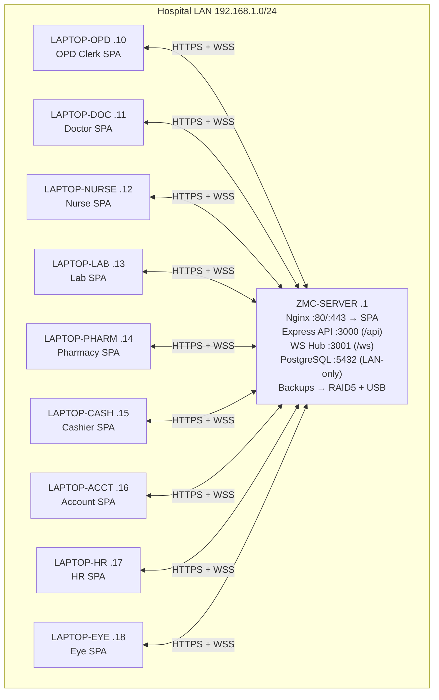
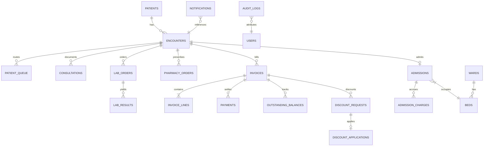
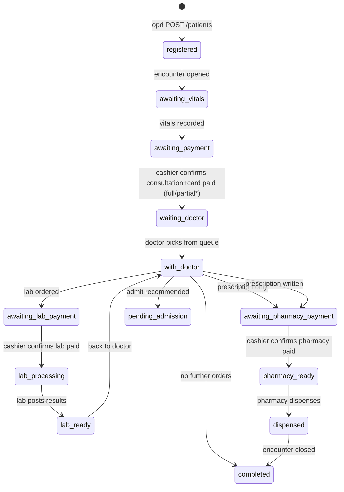
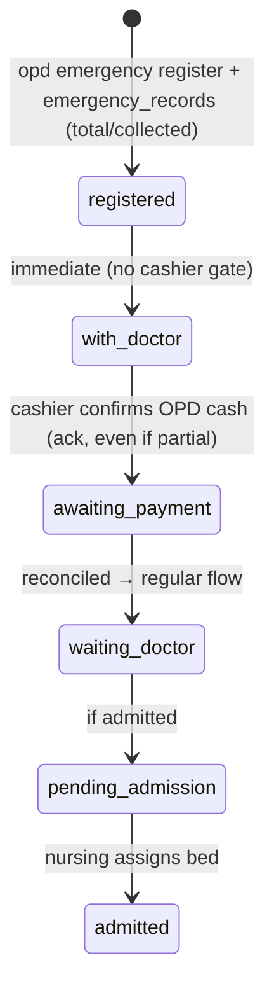
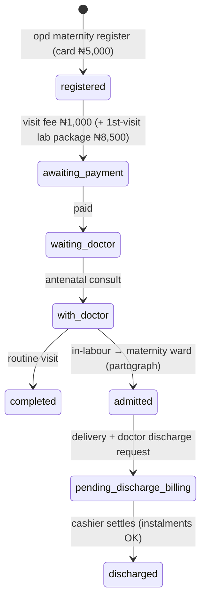
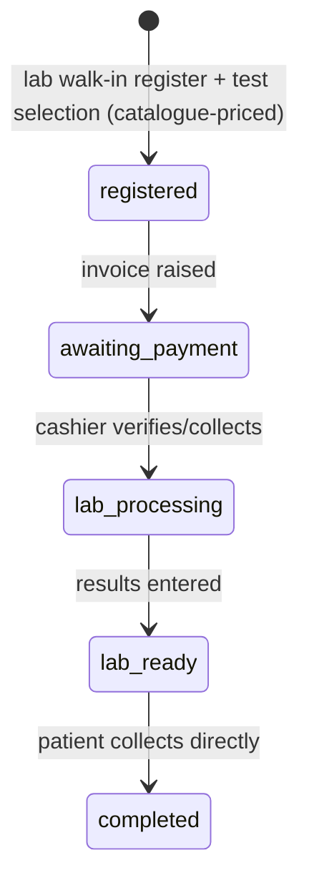
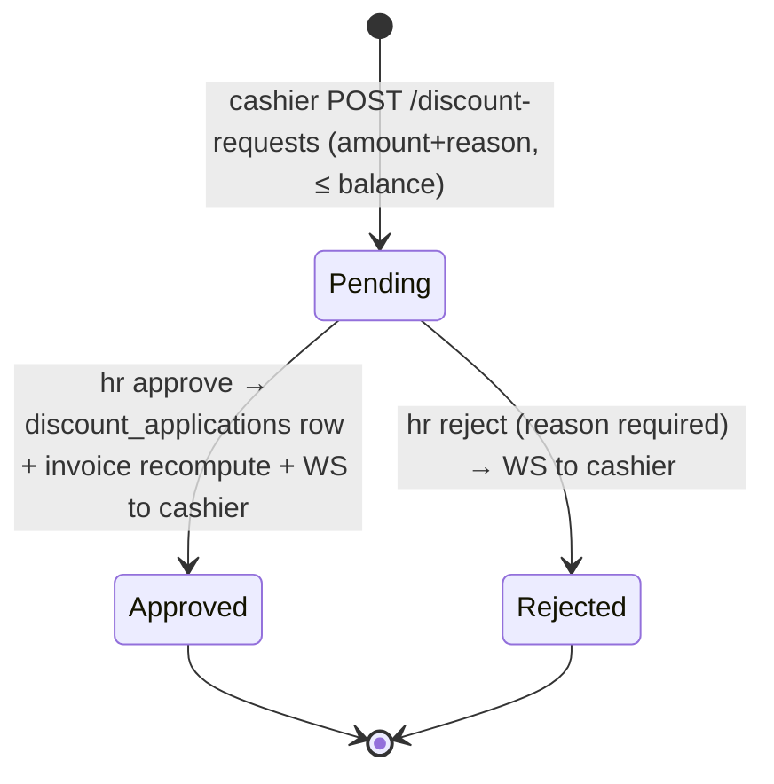
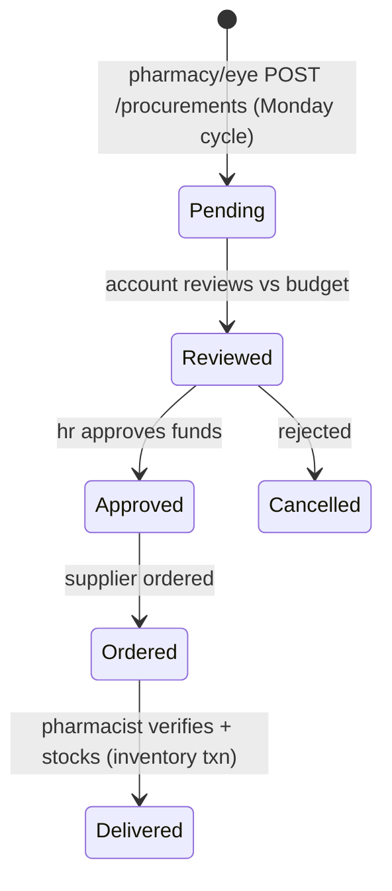
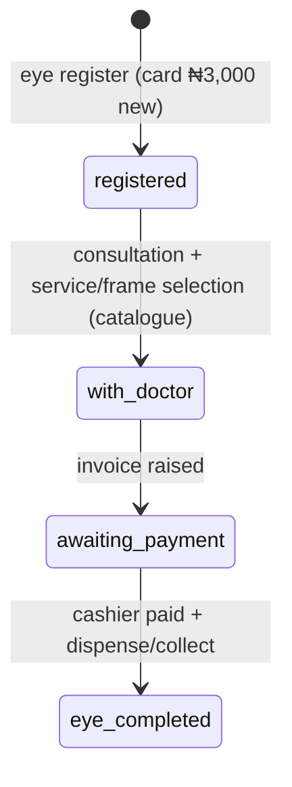

# ZMC EHR — System Design Guide (Production Foundation)

**Version:** 1.0 · **Date:** 2026-10-05 · **Status:** Foundation for production build
**Sources (priority order):** (1) `ZMC_EHR_Implementation_Spec.html` (Spec) · (2) `zmc-process-flow.svg` (Flow) · (3) `ZMC_Intranet_Setup_Guide.html` (NetGuide) · (4) `ZMC_EHR_Server_Storage_Report_5Years.html` (StorageRpt)
**Current state inspected:** React 18 + TS + Tailwind + Vite frontend; `server.ts` (Express + WS on same port); `src/backend/*` route/service/repo/validator pattern; `src/types.ts`; `zmc_*` PostgreSQL tables via DDL-in-code.
**Target:** Intranet-only HMS on LAN server `192.168.1.1`, 9 dept laptops (.10–.18), PostgreSQL + Node/Express + WebSocket, no internet at runtime.

Canonical naming used everywhere in this guide (do not rename per-section):

- **Role keys:** `opd` (OPD Clerk), `cashier` (Cashier), `doctor` (Doctor), `lab` (Lab), `pharmacy` (Pharmacy), `nurse` (Nurse), `eyeclinic` (Eye Clinic), `account` (Account Officer), `hr` (HR Manager) + `it_admin` (IT Administrator, maintenance only). Spec §1 is authoritative; codebase `types.ts` has 17 labels — only these 10 are permitted at login (see §7).
- **Money:** integer **kobo** in DB/API (`amount_kobo`). Display formatting `₦` only at UI edge. Never floats.
- **Attribution rule:** every state-changing write stores `created_by / updated_by` (user id + username + role) and `created_at / updated_at`. No silent overwrites of clinical records — append/version (see §4, §11).

---

## 1. Assumptions and Source Conflicts

### 1.1 Assumptions [ASSUMPTION] (all must hold or be explicitly waived)

1. [ASSUMPTION] Scale targets: ~120 OPD visits/day, ~40 inpatients, ~200 staff, 9 laptops + 1 server. Taken from StorageRpt §2 and brief; used for capacity (§14) and roadmap (§18).
2. [ASSUMPTION] Single physical central server as per NetGuide §2 (i7/Xeon 8+ cores, 16 GB min / 32 GB rec, 2×1 TB SSD RAID1 + 4×2 TB HDD RAID5 in one chassis, APC 1500VA, Ubuntu 22.04, TP-Link SG1016D, CAT6, EAP225 AP). StorageRpt "3-server" is treated as 3 *copies/tiers*, not 3 physical hosts (see §14).
3. [ASSUMPTION] No internet at runtime. Build/patch media arrives via USB/scp from dev machine. No cloud-only service in core path. NTP is via LAN (server is NTP source) [ASSUMPTION — NetGuide does not specify NTP].
4. [ASSUMPTION] All fee **amounts** come from Flow (per brief). Spec text wins on *workflow order*; Flow wins on *prices*.
5. [ASSUMPTION] Power/network can fail at any time. UPS covers short outages only (~15–45 min depending on load [VERIFY — confirm UPS runtime under full load]). Design assumes graceful degrade to paper + spool, never silent loss (§13).
6. [ASSUMPTION] Team = 2 devs. No microservices/K8s/event-sourcing. Single Express monolith + single PG database + single WS hub.
7. [ASSUMPTION] Browsers are evergreen Chrome/Edge on department laptops. No legacy IE. Primary use is desktop/kiosk; mobile is best-effort.
8. [ASSUMPTION] Patient identity is hospital-number based (`REG/EMG/MAT/LD/EYE-…`); no biometric, no HMO/insurance in MVP (listed as future in Spec §14.8).
9. [ASSUMPTION] One active **encounter** per patient at a time for OPD flows; admissions open a separate inpatient episode linked to the same patient (see §4).

### 1.2 Source Conflicts (higher-priority source wins; loser noted + resolution)

| # | Conflict | Sources | Winner & resolution |
|---|----------|---------|---------------------|
| C1 | Card fee: Flow says Clinical Card ₦3,000 (+ Maternity card ₦5,000, Eye card ₦3,000); Spec Regular form only mentions auto-added ₦5,000 consultation fee, `CONSULTATION_FEE=5000` constant. | Spec (1) vs Flow (2) | **Both apply (no true contradiction once combined):** registration creates *two* line items where applicable — card fee (3,000; maternity 5,000; eye 3,000) + consultation fee (5,000). Amounts from Flow. Spec's constant moves to server-side fee catalogue (§10). |
| C2 | Discount effect: Spec §14.4 says HR approval does **not** modify payment (cashier applies manually); Flow says "Bill reduced automatically / instantly reflected". | Spec (1) vs Flow (2) | **Spec wins as-built; design fixes to Flow behaviour:** approval writes an immutable `discount_applications` row and recomputes invoice balance server-side (§10). Manual-only application is rejected (data-integrity risk). Flagged as intentional change. |
| C3 | Discharge absorption: Spec §14.3 says on discharge all pending payments marked `paid` (absorbed) into one `DISCH-` bill. Flow says "Ward charges + Previous balance". | Spec (1) vs Flow (2) | **Spec wins on mechanism; Flow clarifies intent:** do NOT mark absorbed rows `paid` (destroys audit). Instead link them (`discharge_invoice_id`) and set `status='absorbed_into_discharge'` (new enum, append-only). See §10. |
| C4 | Eye Clinic money: Spec §14.11 says eye charges live in separate `eye_clinic_records` localStorage, not main payments; Flow says "Patient pays to Cashier; returns with proof". | Spec (1) vs Flow (2) | **Spec wins as-built; design unifies:** eye charges become standard invoices/line-items payable at Cashier (§4, §10). Separate ledger is retired in migration (§5). |
| C5 | Server count: StorageRpt demands 3-server redundant arch (Primary + On-site Backup + Off-site/Cloud); NetGuide mandates 1 central server, physically isolated, no internet. | NetGuide (3) vs StorageRpt (4) | **NetGuide wins.** "3-server" reinterpreted as 3 *copies*: (a) primary RAID1 SSDs, (b) on-site backup RAID5 HDDs in same chassis + external USB/NAS in locked second room, (c) encrypted off-site **offline** media (rotated USB HDD), not cloud. Cloud is non-compliant with no-internet constraint. |
| C6 | Hardware vs storage size: StorageRpt provisions 133 GB × 3 = 400 GB; NetGuide provides ~1 TB usable primary + ~6 TB usable backup. | NetGuide (3) vs StorageRpt (4) | **No conflict after reconciliation** — hardware exceeds 5-yr need by wide margin (§14). No hardware change; flag that "133 GB" is logical allocation, not physical purchase. |
| C7 | Sample `server.js` in NetGuide §5 uses hardcoded secrets (`ZMC@Secure2024!`, `ZMCHospitalSecretKey2024!`), `SELECT *`, dynamic `SET ${field}` (SQL-injection), plain `http://`/`ws://`, `listen_addresses` + `gateway4 192.168.1.254` + `8.8.8.8` DNS (implies internet). | Guardrails vs NetGuide (3) | **Guardrails win. All insecure patterns are banned** and replaced in §6/§11. `8.8.8.8`/gateway are corrected to LAN-only (no external DNS at runtime). |
| C8 | After-hours definition: Flow emergency box says "After hours (8am–6pm)" — inverted/ambiguous. | Flow (2) internal | **Flagged ambiguous.** Design assumes After-hours = *outside* 08:00–18:00 [ASSUMPTION]. No surcharge amount is given, so no auto-surcharge; record flag only. See §10, §20 Q3. |
| C9 | Dual prices: LFT ₦12,000/₦15,000; SEUC ₦12,000/₦15,000. No rule for which applies. | Flow (2) internal | **Flagged.** Catalogue stores both as separate SKUs (`LFT_BASIC`, `LFT_FULL`) with explicit names; doctor must pick one. No silent default (§10). |
| C10 | Roles: `types.ts` lists 17 roles (incl. Administrator, Management, Receptionist, Records Officer, Lab Scientist…); Spec lists 9 + HR discount role. | Spec (1) vs code | **Spec wins.** Production allows 9 operational + `it_admin` (+ optional `auditor` read-only). Other labels are retired/aliased (§7). |
| C11 | Nursing dispensing/injection records + eye records in own localStorage keys, unlinked to patient (Spec §14.11–12). | Spec (1) internal | **Accepted as as-built gap; design links all to patient+encounter** with FKs (§4, §5). |
| C12 | NetGuide firewall opens 443 (HTTPS) but only documents HTTP deployment; no TLS cert process. | NetGuide (3) internal | **Gap fixed in §11:** LAN-TLS via private CA + Nginx termination; HSTS + redirect. Plain HTTP is banned for production. |
| C13 | "Doctor on-call fee ₦5,000" listed under Emergency Fee Schedule — unclear if additive per emergency or conditional. | Flow (2) internal | **Assumed additive when `is_doctor_on_call=true`** [ASSUMPTION]. Recorded as separate line item, never folded silently (§10). |

---

## 2. Architecture overview

**Decision — monolithic Express API + co-located WS hub + PostgreSQL + Nginx static hosting on one LAN server.**
*Reason:* 2 devs, 120 visits/day, single site, no internet. Operational simplicity, single backup unit, and trivial transaction boundaries outweigh any scaling benefit of services.
*Alternative considered:* separate API/WS/auth services, K8s, event-sourcing — rejected: numbers do not justify; increases failure modes and backup complexity.



Request path: Browser → Nginx (TLS, static SPA, `/api/*` → Express :3000, `/ws` → WS :3001) → Express (authN/Z, validation, transactions) → PostgreSQL (single DB, row-level audit triggers). WS hub publishes role-targeted events; `notifications` table is the durable counterpart (see §9). No outbound internet in core path; NTP/DNS are LAN-local.

---

## 3. Component responsibilities

| Component | Owns | Must NOT own |
|-----------|------|--------------|
| **SPA (React 18 + Vite + Tailwind, per-role views)** | Rendering, form validation (mirror of server), JWT storage (memory + session guard), WS subscribe/reconnect, optimistic UI with server reconciliation, Excel export (client-side `xlsx` from API data) | Price math, status transitions, auth decisions. Never trusts localStorage for truth post-MVP. |
| **Nginx** | TLS termination (LAN CA), static SPA serving, reverse proxy (`/api`, `/ws`), gzip, `client_max_body_size 10M`, rate-limit login/API, security headers | Business logic, auth |
| **Express API (`/api/v1`)** | JWT authN, RBAC authZ, Zod/express-validator validation, transactional billing/state-machine enforcement, catalogue pricing (server-only), audit-log writes, notification fan-out | Direct SQL string building (use parametrised repo layer only), file-PHI in logs |
| **PostgreSQL 15+** | System of record; FKs, CHECKs, unique invoice numbers, `amount_kobo BIGINT CHECK >=0`, audit triggers, `pgcrypto` for hashing where needed | Business-rule branching (kept in API for testability; DB enforces invariants) |
| **WS Hub (:3001, `ws` lib)** | Authenticated sockets (JWT `AUTH` handshake), role-targeted broadcast, heartbeat/reconnect, replay of missed `notifications` on rejoin | Durability (DB is durable; WS is ephemeral) |
| **Backup agent (cron + script)** | `pg_dump` daily 02:00 → RAID5 + verify + rotate; weekly full + daily WAL-ish logical dumps (no PITR luxury on single node — documented limit); encrypted USB rotation | Application code |
| **Seed/Migration runner** | Versioned SQL migrations (`migrations/NNNN_*.sql`), idempotent catalogue backfill (lab/meds/eye from `src/backend/catalogue/*`), blocked seeding in prod without explicit flag | Runtime business logic |

---

## 4. Data model: entities, keys, relationships, status enums

**Keys:** UUIDv7 (`gen_random_uuid_v7()` or app `crypto.randomUUID`) as PKs; human-facing numbers (`hospital_number`, `invoice_number`, `receipt_number`) are separate UNIQUE columns with sequences. **Money:** all `*_kobo BIGINT NOT NULL CHECK (>=0)`. **Clinical immutability:** `consultations`, `vitals`, `observations`, `lab_results`, `medication_administrations` are INSERT-only (no UPDATE/DELETE except IT-admin correction with `supersedes_id` + reason; history preserved).

### 4.1 Core tables

| Table | PK / Uniques | Key FKs | Purpose |
|-------|--------------|---------|---------|
| `users` | `id` PK, `username` UNIQUE | — | Staff login; `password_hash` (bcrypt), `role_key`, `department`, `status` |
| `patients` | `id` PK, `hospital_number` UNIQUE, `maternity_number` UNIQUE NULL | — | Demographics; `card_type`, `status` (current OPD-level status) |
| `patient_vitals` | `id` PK | `patient_id→patients`, `encounter_id→encounters` | Append-only triage/inpatient vitals + `recorded_by` |
| `maternity_records` | `id` PK | `patient_id`, `encounter_id` | Gravida/para/LMP/EDD/tribe/occupation (append-only) |
| `emergency_records` | `id` PK | `patient_id`, `encounter_id` | Flags + `total_bill_kobo`, `cash_collected_kobo`, `doctor_on_call_name` |
| `encounters` | `id` PK | `patient_id→patients` | One visit/episode; `visit_number`, `visit_type`, `destination_clinic`, `priority`, `payment_status`, `clinical_status`, `closed_at` |
| `patient_queue` | `id` PK | `encounter_id`, `patient_id` | Routable queue rows: `queue_type`, `status` (`Waiting/InProgress/Done/Skipped`) |
| `consultations` | `id` PK | `patient_id`, `encounter_id`, `doctor_id→users` | Notes/diagnosis/plan, `prescriptions JSONB` snapshot + normalised `medication_orders` |
| `lab_orders` / `lab_results` | `id` PK | `patient_id`, `encounter_id`, `doctor_id`; results→orders | Order (`test_code`, `price_kobo` snapshotted) / result (append-only `result_details`, `findings`) |
| `pharmacy_orders` | `id` PK | `patient_id`, `encounter_id`, `prescribed_by` | `items JSONB` + normalised status; `medication_code`, dosage/frequency/duration |
| `invoices` | `id` PK, `invoice_number` UNIQUE | `patient_id`, `encounter_id` | Header; `total_kobo`, `paid_kobo` (maintained by trigger from payments), `balance_kobo` generated, `status` |
| `invoice_lines` | `id` PK | `invoice_id`, `catalogue_ref` | One billable: card/consult/lab/pharmacy/ward/procedure/eye; `qty`, `unit_price_kobo`, `line_total_kobo`, `absorbed_into_discharge_id` NULL |
| `payments` | `id` PK, `receipt_number` UNIQUE | `patient_id`, `encounter_id`, `invoice_id` | Each cash receipt; `amount_kobo`, `method`, `collected_by`; never negative (refunds are reversal rows) |
| `outstanding_balances` | `id` PK | `patient_id`, `encounter_id`, `invoice_id` | Derived/current owing per invoice (trigger-maintained) + `status` (`Owing/PartiallyPaid/Cleared`) |
| `discount_requests` | `id` PK | `patient_id`, `encounter_id`, `invoice_id` | `requested_amount_kobo`, `reason`, `status`, `reviewed_by/at`, `rejection_reason` |
| `discount_applications` | `id` PK | `discount_request_id`, `invoice_id` | Immutable applied discount (`amount_kobo`) — only created on HR approve |
| `admissions` | `id` PK | `patient_id`, `encounter_id` | Ward/bed, next-of-kin, religion, `detention` flag, admit/discharge timestamps |
| `wards` / `beds` | `id` PK | `beds.ward_id→wards`, `beds.current_admission_id` | Bed census; assignment is transactional (no double-book) |
| `nursing_observations` | `id` PK | `patient_id`, `admission_id` | Append-only notes |
| `medication_administrations` | `id` PK | `patient_id`, `admission_id`, `order_id` | Dose + time + nurse |
| `admission_charges` | `id` PK | `admission_id`, `invoice_line_id` | Ward/procedure/consumable charges feeding discharge bill |
| `inventory` / `suppliers` / `procurements` (+`procurement_lines`) | `id` PK | lines→procurements/suppliers | Stock + multi-item orders; `status` lifecycle |
| `employees` / `absences` / `job_openings` / `candidates` / `employee_documents` | `id` PK | absences/candidates/docs → employees/openings | HR domain |
| `notifications` | `id` PK | `patient_id`, `encounter_id` NULL | Durable event log (`from_role`, `target_role`, `type`, `message`, `read_at`) — WS mirrors this |
| `audit_logs` | `id` PK | `user_id` | Who/what/when/which row (`table_name`, `row_id`, `action`, `details` JSONB — **no PHI in plaintext**, see §11) |
| `fee_catalogue` (`lab_tests`, `medications`, `eye_services`, `service_fees`) | `code` PK | — | Server-owned prices in kobo; effective-dated (`valid_from/to`) |
| `pricing_review_queue` | `id` PK | `patient_id`, `encounter_id` | Unknown codes parked here, never silently priced (existing `zmc_pricing_review` retained) |
| `pvs` (payment vitae) / `free_treatments` | `id` PK | — | Daily expenses + staff/dependant free-care register |

### 4.2 Status enums (canonical — use exactly)

- `patients.status`: `registered` · `awaiting_vitals` · `awaiting_payment` · `waiting_doctor` · `with_doctor` · `awaiting_lab_payment` · `lab_processing` · `lab_ready` · `awaiting_pharmacy_payment` · `pharmacy_ready` · `dispensed` · `completed` · `pending_admission` · `admitted` · `detained` · `pending_discharge_billing` · `discharged` · `referred_eye` · `eye_completed`
- `encounters.payment_status`: `Unpaid` · `Partial` · `Paid` · `Waived` · `AbsorbedIntoDischarge`
- `encounters.clinical_status`: `PendingVitals` · `PendingConsult` · `InConsult` · `PendingLab` · `PendingPharmacy` · `Done` · `Admitted` · `Discharged`
- `invoices.status`: `Unpaid` · `Partial` · `Paid` · `Discounted` · `AbsorbedIntoDischarge` · `Voided` (void = reversal rows, never delete)
- `discount_requests.status`: `Pending` · `Approved` · `Rejected`
- `procurements.status`: `Pending` · `Reviewed` · `Approved` · `Ordered` · `Delivered` · `Cancelled`
- `queue.status`: `Waiting` · `InProgress` · `Done` · `Skipped`

### 4.3 ER diagram (core clinical+billing slice)



> Every entity above is used by ≥1 API group in §6 and ≥1 state machine in §8. `fee_catalogue` + `pricing_review_queue` prevent silent pricing (§10).

---

## 5. Migration plan: localStorage prototype → PostgreSQL

**Decision — strangler migration behind the existing route/service/repo pattern, one domain at a time, with dual-write + verification before cutover.**
*Reason:* 2 devs, live hospital, no data loss tolerance. Big-bang rewrite risks patient/billing loss.
*Alternative:* full rewrite + bulk import — rejected (unverifiable, no rollback).

| Phase | Scope | Dual-write / backfill | Cutover gate |
|-------|-------|----------------------|--------------|
| M0 Freeze | Freeze localStorage keys as documented (Spec §13: `hospital_patients`, `hospital_employees`, `hospital_absences`, `hospital_requisitions`, `hospital_candidates`, `hospital_procurements`, `hospital_discount_requests`, `cashier_pv_entries`, `cashier_nocharge_entries`, `eye_clinic_records`, `pharmacy_stock`, `nursing_dispensing`, `nursing_injections`); add export button dumping each key to JSON | — | Inventory of keys + row counts signed off |
| M1 Auth+Users | `users` table, bcrypt hashes (cost 12), JWT issuance/verify; retire "any username+role succeeds" | Import 10 canonical users; force password reset on first login | All 9 roles can log in via API; old path disabled by feature flag |
| M2 Patients+Encounters+Queue | Normalise patient JSON (vitals/maternity/emergency split to child tables per `db.repo.ts` `refreshCache` mapping); generate `hospital_number` for legacy rows missing it; dedupe by (name+DOB+phone) to review queue (never auto-merge) [ASSUMPTION] | Backfill script idempotent, dry-run report first | OPD register→queue→cashier→doctor works end-to-end on PG |
| M3 Billing (invoices/lines/payments/outstanding/discounts/PV) | Convert `amount/amountPaid` floats → `*_kobo` BIGINT (round half-up, reconcile diffs to review); rebuild `outstanding` from invoices−payments (do not trust stored balances); import discounts as requests+applications | Balance reconciliation report = 0 unexplained kobo | Cashier pending/outstanding/discharge tabs read from PG |
| M4 Clinical (consult/lab/pharm orders+results, nursing obs/admin, admissions/beds/charges) | Link orphan `eye_clinic_records`, `nursing_dispensing`, `nursing_injections` to patient+encounter (unmatched → `pricing_review_queue`-style `linkage_review` with UI) | Spot-check 50 encounters end-to-end | Doctor/Lab/Pharmacy/Nurse views on PG |
| M5 HR/Procurement/Inventory | Employees/absences/openings/candidates/procurements/suppliers/docs (docs as file refs, not blobs; 800 KB scans stay on disk with DB pointers) | Row-count parity | HR/Account tabs on PG; Excel export from API |
| M6 Decommission | Read-only localStorage fallback removed; `Reset Demo` button removed from prod (or `it_admin`-only + typed confirm + audit); seed blocked in prod | Final pg_dump + restore-test | Staging sign-off → prod cutover (see §15) |

**Insecure-pattern fixes applied during migration (note the change):** parametrised queries only (ban dynamic `SET ${k}` — whitelist columns in validators); explicit column lists (ban `SELECT *` in app code); `amount_kobo` integers; secrets from env/file, never code; HTTPS/WSS only.

---

## 6. API design

**Base:** `https://192.168.1.1/api/v1` (versioned; unversioned `/api/*` retained as 301 to `/v1` for 6 months). Auth: `Authorization: Bearer <JWT>` (8 h, LAN-only). Errors: RFC-7807-ish `{ error:{ code, message, details? }, traceId }`. Pagination: `?page&perPage&sort&order` + `X-Total-Count`. Idempotency: `Idempotency-Key` header on POST payments/discharges. All billing inputs in kobo.

**Decision — keep Express route→controller→service→repository→validator layering already in codebase.**
*Reason:* matches team muscle memory; testable;最小 churn.
*Alternative:* tRPC/GraphQL — rejected (tooling + offline + 2-dev cost).

### 6.1 Endpoints by module (screen → endpoint trace)

| Module (screen) | Endpoints |
|-----------------|-----------|
| Auth (LoginScreen) | `POST /v1/auth/login` (username+password → JWT+role) · `POST /v1/auth/logout` (audit + token denylist until expiry) · `GET /v1/auth/me` · `POST /v1/auth/refresh` (rotation, 1× only) |
| OPD (Register/Returning/Maternity/Emergency/Admissions tab) | `POST /v1/patients` · `GET /v1/patients?q&cardType&status` · `GET /v1/patients/:id` (+ `?include=vitals,maternity,emergency,encounters,balances`) · `PATCH /v1/patients/:id` (whitelisted fields only) · `POST /v1/encounters` (open visit) · `POST /v1/encounters/:id/vitals` · `POST /v1/encounters/:id/maternity` · `POST /v1/encounters/:id/emergency-cash` (total+collected → creates invoice+payment+outstanding atomically) · `GET /v1/queue?clinic&status` · `POST /v1/queue/:id/advance` (state-machine guarded) |
| Cashier (Pending/Discharge/Outstanding/PV/Discounts) | `GET /v1/invoices?status&patientId` · `GET /v1/invoices/:id` (with lines+payments+discounts) · `POST /v1/payments` (invoiceId+amount_kobo+method; triggers balance recompute + WS) · `GET /v1/outstanding?patientId` · `POST /v1/outstanding/:id/settle` · `POST /v1/pvs` · `GET /v1/pvs` · `DELETE /v1/pvs/:id` (`it_admin`/`account` only, audit) · `POST /v1/discount-requests` · `GET /v1/discount-requests?status` · `POST /v1/free-treatments` (staff/dependant, separate register) |
| Doctor (Outpatient/Admitted + 6 sub-tabs) | `GET /v1/queue?queueType=Doctor%20Consultation&status=Waiting` · `POST /v1/consultations` (append-only) · `POST /v1/lab-orders` (catalogue codes only; unknown → 422 + `pricing_review_queue` entry) · `POST /v1/pharmacy-orders` (same rule) · `POST /v1/admissions/recommend` → `pending_admission` · `POST /v1/admissions/:id/request-discharge` (computes bill, creates `DISCH-` invoice, links absorbed lines) · `GET /v1/patients/:id/ehr` (consult-locked export for Download EHR) |
| Lab (Regular/Walk-in) | `GET /v1/lab-orders?status=PendingPayment|Paid|Processing` · `POST /v1/walkin-lab-registrations` (creates patient stub + encounter + invoice atomically) · `POST /v1/lab-orders/:id/start` · `POST /v1/lab-results` (append-only; order→`Completed`) · `GET /v1/catalogue/lab-tests` |
| Pharmacy (Dispense/Admitted/Procurement/Stock) | `GET /v1/pharmacy-orders?status` · `POST /v1/pharmacy-orders/:id/dispense` (decrements stock transactionally; insufficient → 409) · `GET /v1/inventory` · `PATCH /v1/inventory/:id/adjust` (reason required, audit) · `POST /v1/procurements` (multi-line) · `GET /v1/catalogue/medications` |
| Nursing (Admitted/Detained/Dispensing/Injections + 4 care tabs) | `POST /v1/admissions/:id/assign-bed` (transactional bed lock) · `POST /v1/admissions/:id/vitals` · `POST /v1/admissions/:id/observations` · `POST /v1/admissions/:id/administer` · `POST /v1/admissions/:id/charges` (→ invoice line) · `POST /v1/admissions/:id/detain` / `:id/process-discharge` · `GET /v1/wards` + `/beds?wardId&free=1` |
| Eye Clinic (Register/Consult/Records) | `POST /v1/eye/registrations` (unified patient, `cardType=Eye`) · `POST /v1/eye/consultations` · `POST /v1/eye/orders` (services+frames catalogue codes) → standard invoice · `GET /v1/eye/records?q` |
| Account (Overview/Doctors/Lab/Pharmacy/Procurement/Outstanding/Discounts + Excel) | `GET /v1/reports/revenue?groupBy=day,week,month&dept&clinician` · `GET /v1/reports/outstanding` · `GET /v1/reports/discounts` · `GET /v1/reports/procurements` · `GET /v1/exports/transactions.xlsx` (server-generated; client `xlsx` retired for canonical reports) |
| HR (Dashboard/Employees/Absences/Recruitment/Procurement/Discounts) | `CRUD /v1/employees` (+ `/v1/employees/:id/documents` metadata) · `CRUD /v1/absences` · `CRUD /v1/recruitments/openings` + `/candidates` · `POST /v1/procurements/:id/review|approve|order|deliver` · `POST /v1/discount-requests/:id/approve|reject` (approve creates `discount_applications` + recompute + WS to `cashier`) |
| Notifications/WS | `GET /v1/notifications?targetRole&unread=1` · `POST /v1/notifications/:id/read` · `POST /v1/notify` (creates row + WS fan-out; internal) · `WSS /ws` (`AUTH` handshake, heartbeat) |
| Admin/Maintenance (`it_admin` only) | `GET /v1/health` · `GET /v1/db-test` (no PHI) · `POST /v1/maintenance/cache-clear|vacuum` · `GET /v1/maintenance/backup` (encrypted, audited; replaces raw JSON dump — see §11) · `POST /v1/maintenance/clear-store|system-reset` (typed confirm + dual-approval [ASSUMPTION], full audit; staging-only unless emergency runbook invoked) |

### 6.2 Auth, errors, versioning (normative)

- Login: bcrypt compare (cost 12), generic `401 Invalid credentials` (no user-enumeration), JWT `sub/id, username, role_key, dept` + `jti`, 8 h expiry, refresh rotation once. WS `AUTH` uses same JWT; expiry → `AUTH_EXPIRED` + HTTP 401 on next API call (client refreshes).
- AuthZ: `authenticateJWT` → `authorizeRoles([...role_keys])` per route (matrix in §7 enforced server-side, never client-only).
- Validation: whitelist-body validators per route (fixes NetGuide dynamic-column flaw); unknown lab/med codes → `422 UNKNOWN_CODE` + auto `pricing_review_queue` row (never silent fallback price).
- Errors: `400 VALIDATION` · `401/403 AUTH` · `404 NOT_FOUND` · `409 CONFLICT` (bed taken, stock short, duplicate invoice) · `422 STATE` (illegal transition) / `UNKNOWN_CODE` · `429 RATE_LIMIT` · `5xx` with `traceId`, no stack/PHI to client.
- Versioning: `/api/v1`; breaking change → `/v2` + 6-month dual-serve; catalogue/fee changes are data (effective-dated), not API breaks.

---

## 7. Role-permission matrix (role × resource × action)

Legend: **C**reate **R**ead **U**pdate **D**elete **A**pprove · `—` denied · `own` = own dept/patient scope. Server enforces; UI hides denied actions.

| Resource | opd | cashier | doctor | lab | pharmacy | nurse | eyeclinic | account | hr | it_admin |
|----------|-----|---------|--------|-----|----------|-------|-----------|---------|----|----------|
| Patients (register/search/update demo) | CRU | R | R | R (walk-in: CR) | R | R | CRU (eye) | R | — | R |
| Vitals (triage/inpatient) | — | — | R | — | — | CRU* | CRU* (eye vitals) | — | — | R |
| Encounters/Queue advance | CRU | R (advance on pay) | CRU | CRU (lab queue) | R | CRU (admit flow) | CRU | R | — | R |
| Consultations/Notes/Orders | — | — | CRU* | — | — | R | CRU* (eye) | — | — | R |
| Lab orders/results | — (view) | R | C (order) | CRU* (process) | — | R | C/R (eye labs) | R | — | R |
| Pharmacy orders/dispense/stock adjust | — | R | C (prescribe) | — | CRU (+D void w/ audit) | C (administer) | C (eye meds) | R | — | R |
| Invoices/Payments/Outstanding/PV | — | CRUD (void w/ audit, no hard delete) | R | R | R | C (ward charges) | R | R | — | R |
| Discharge request / settle-discharge | — | U (settle) | C (request) | — | — | U (process) | — | R | — | R |
| Discount request / approve-reject | — | C (request) | — | — | — | — | C (request eye) | R | A | R |
| Procurement request/review/approve | — | — | — | — | C | — | C (eye supplies) | RU (review) | A | R |
| Employees/Absences/Recruitment/Docs | — | — | — | — | — | — | — | R | CRUD | R |
| Reports/Exports (revenue/perf/outstanding) | — | R (own) | R (own) | R (own) | R (own) | — | R (own) | CRU (exports) | R (HR/procure/discount) | R |
| Audit logs | — | — | — | — | — | — | — | R | — | CRUD (clear dual-approved) |
| Maintenance (backup/clear/reset/vacuum) | — | — | — | — | — | — | — | — | — | C |

`*` = append/version only (no silent edit of clinical rows). `it_admin` never edits clinical/billing content except correction workflow with `supersedes_id` + reason + audit.

---

## 8. State machines for every workflow (patient status transitions)

Global rule: all transitions are server-side, guarded by role + invoice/queue preconditions, and write `audit_logs` + `notifications` + WS event. Illegal transition → `422 STATE`.

### 8.1 Regular OPD


`*`Partial allowed → `encounter.payment_status=Partial` + `outstanding_balances` row; flow continues (Flow §Payment Flow).

### 8.2 Emergency (OPD collects cash first, doctor immediately)


`emergencyCashConfirmed=true` means *acknowledged*, not *fully paid* (Spec §14.6). Balance → Outstanding.

### 8.3 Maternity / Antenatal



### 8.4 Walk-in Lab



### 8.5 Admission / Discharge (+ Detention)

```mermaid
stateDiagram-v2
  [*] --> pending_admission: doctor recommends
  pending_admission --> admitted: nurse assigns ward+bed (txn lock)
  pending_admission --> detained: observation only (no bed)
  detained --> admitted: formal admit
  detained --> completed: released from observation
  admitted --> pending_discharge_billing: doctor request-discharge (bill computed, DISCH- invoice, lines linked not deleted)
  pending_discharge_billing --> discharged: cashier settles (full; partial stays Owing but patient may remain pending per policy §10)
  discharged --> [*]
```


Daily loop while `admitted`: vitals → meds → observations → doctor review → charges (each append-only).

### 8.6 Discount approval



### 8.7 Procurement



### 8.8 Eye Clinic



---

## 9. Real-time notifications: events, channels, delivery guarantees

**Channel:** WSS `wss://192.168.1.1/ws` (TLS; NetGuide `ws://` fixed). Auth: `AUTH {token}` → `AUTH_SUCCESS`/`AUTH_EXPIRED`. Heartbeat 25 s; client reconnect 3 s backoff + resync via `GET /v1/notifications?unread=1` (covers missed WS frames). Durability: every fan-out first INSERTs `notifications` (transactional with the domain write), then broadcasts; WS is ephemeral, DB is truth.

| From → To | Event `type` | Trigger (API txn) |
|-----------|--------------|-------------------|
| opd → cashier | `CONSULT_PAYMENT_DUE` | encounter opened / emergency-cash recorded |
| cashier → doctor | `PATIENT_READY` | consultation/card payment confirmed |
| doctor → cashier | `LAB_PAYMENT_DUE` / `PHARMACY_PAYMENT_DUE` | lab/pharmacy order created |
| cashier → lab | `LAB_READY_TO_PROCESS` | lab payment confirmed |
| lab → doctor | `LAB_RESULTS_READY` | results posted |
| cashier → pharmacy | `DISPENSE_DUE` | pharmacy payment confirmed |
| pharmacy → nurse/doctor | `DISPENSED` | dispensed/administered |
| doctor → nurse | `ADMISSION_PENDING` | admit recommended |
| nurse → doctor | `ADMITTED` | bed assigned |
| doctor → cashier | `DISCHARGE_BILL_READY` | request-discharge (DISCH- invoice) |
| cashier → nurse | `DISCHARGE_SETTLED` | discharge settled |
| lab → cashier/doctor | `WALKIN_PAYMENT_DUE` / `WALKIN_RESULTS_READY` | walk-in invoice / results |
| cashier → hr | `DISCOUNT_REQUESTED` | discount requested |
| hr → cashier (+account log) | `DISCOUNT_DECIDED` | approve/reject |
| pharmacy → account/hr | `PROCUREMENT_*` | submit/review/approve/deliver |

**Guarantees:** at-least-once (DB row + WS + unread-pull on reconnect); ordering per-encounter via `encounter_id` + `created_at` seq; no PHI in WS payload beyond `patient_id + display name + message` over TLS; toast + optional audio on client; `read_at` tracking per role.

---

## 10. Billing logic (normative — all amounts kobo)

**Fee catalogue (from Flow; stored server-side, effective-dated, admin-editable with approval):**

| Item | Amount (₦) | Notes |
|------|-----------|-------|
| Clinical Card (regular) | 3,000 | per new registration |
| Consultation Fee | 5,000 | auto-added; partial allowed |
| Maternity Card (clinical+maternity) | 5,000 | replaces regular card for maternity |
| Maternity Visit Fee | 1,000 | per antenatal visit |
| 1st-visit Lab Package (VDRL,HP,MP,RVS,UA) | 8,500 | bundled SKU, not sum of parts |
| Emergency: Sick / Unbooked Labour / Accident | 25,000 / 50,000 / 50,000 | OPD records Total/Collected/Balance |
| Doctor on-call fee | 5,000 | additive when `is_doctor_on_call` [ASSUMPTION] |
| Lab: MP Std 3,000 · MP Comp 5,000 · Widal 5,000 · UA 3,000 · FBC 7,000 · Hb 3,000 · FBS/RBS 2,000 · LFT 12,000/15,000* · SEUC 12,000/15,000* · PSA 15,000 · HBA1c 10,500 · Hormonal 90,000 · Cholesterol 10,000 · T-Bilirubin 7,000 · RVS 5,000 · HbsAg 3,500 · Syphilis 3,500 · Blood Group 3,000 · Genotype 10,000 · Cross-match 10,000 · C&S 18,000 · Sputum 18,000 · HP 5,000 | as listed | `*` = two SKUs, explicit pick (C9) |
| Eye: Card 3,000 · VA 1,000 · AutoRef 5,000 · Tonometry 5,000 · CVF 10,000 · SlitLamp 10,000 · Ophthalmoscopy 1,000 · Frames 15,000/20,000/35,000 · Irrigation 5,000 · FB removal 10,000 · Dilation 2,000 | as listed | unified invoice (C4 fix) |

**Rules:**

1. Invoice = header + immutable lines (`qty × unit_price_kobo`). `total_kobo` = Σ lines − Σ applied discounts. `paid_kobo` = Σ payments (trigger). `balance = total − paid`. Partial payment always allowed (Flow); each receipt is a separate `payments` row with sequential `receipt_number`; outstanding row updated, never deleted until `Cleared`.
2. Instalments (2nd/3rd) post to same `invoice_id` with idempotency keys; overpay → `409` (or credit note row [ASSUMPTION — policy choice, default reject overpay]).
3. Discounts: request ≤ balance, reason required; HR approve → `discount_applications` + recompute (C2 fix); reject needs reason; all in Account Discounts Register; free treatments (staff/dependants/MD relatives) use separate `free_treatments` register, not discount flow.
4. Discharge bill = Σ open `admission_charges` + Σ linked prior unpaid invoice balances (linked via `absorbed_into_discharge_id`, status `AbsorbedIntoDischarge` — never marked `Paid`, C3 fix). `DISCH-<seq>` invoice in Cashier Discharge Bills; `patient.status=pending_discharge_billing` until settled; only then `discharged`. Partial discharge payment keeps status pending (policy default; configurable threshold [ASSUMPTION]).
5. PVs (Payment Vitae): daily expenses, `approved_by` default Doctor, deletable only by `account`/`it_admin` with audit + totals footer.
6. Unknown lab/med/eye code → `422` + `pricing_review_queue` row; cashier cannot price manually. Catalogue backfill owns prices.
7. Display: `₦5,000.00` from `500000` kobo via single `formatKobo()` helper; API never accepts naira floats.

---

## 11. Security

**Decisions (each fixes a NetGuide-sample flaw — note the change):**
- **Secrets:** env/file (`/etc/zmc/.env`, root-only 600) or systemd `EnvironmentFile`; never in code/logs; JWT ≥256-bit random; separate `DB_PASSWORD`, `JWT_SECRET`; rotation runbook. *(Fixes hardcoded `ZMC@Secure2024!`.)*
- **Transport:** Nginx TLS with private LAN CA (distribute CA to 9 laptops once) + `wss://`; HSTS; HTTP→HTTPS redirect. *(Fixes plain `http/ws`.)*
- **DB:** parametrised queries + whitelist validators only *(fixes dynamic `SET ${k}`)*; explicit columns *(fixes `SELECT *`)*; `pg_hba` LAN-only `md5/scram`, `listen_addresses='192.168.1.1'`; app role least-privilege (no SUPERUSER/DDL at runtime; migrations via separate owner); daily `ANALYZE`.
- **Passwords:** bcrypt cost 12; generic login errors; lockout 5 fails/15 min + audit; first-login reset; 8 h JWT + single-use refresh; WS re-auth on expiry.
- **Sessions:** server-side denylist (`jti`) until expiry on logout; idle warning 15 min before expiry [ASSUMPTION]; no concurrent-session ban (ward usability) but audit each login.
- **Audit:** append-only `audit_logs` (trigger + service writes: user, role, IP, table, row, action, before/after hash — **no PHI plaintext**; details reference IDs). `TRUNCATE`/clear requires `it_admin` + typed confirm + second approver + pre-export.
- **Backup secrecy:** dumps encrypted (age/GPG) before touching USB; filenames without patient identifiers.
- **Headers/limits:** `helmet`-equiv headers, CORS allowlist `https://192.168.1.1` only (fixes `origin:true`), JSON 1 MB, login rate-limit, `50M→10M` upload cap (lab attachments), file-type allowlist + AV-scan hook [ASSUMPTION].

---

## 12. Compliance: Nigeria Data Protection Act 2023

>cite the Act as named in brief; procedural specifics (filing thresholds, fees) marked [VERIFY] with NDPC.

- **Lawful basis & consent:** treatment contract + explicit consent captured at registration (paper→scan or e-tick + timestamp + staff witness); separate consent for maternity/minor/guardian flows [ASSUMPTION on wording — legal review required]. Withdrawal path documented; withdrawal ≠ deletion of clinical safety record (retention overrides with justification logged).
- **Rights:** access, correction (via `supersedes` correction, original retained), deletion where retention permits, objection; fulfilled via `it_admin` + DPO within statutory window [VERIFY days].
- **Minimisation & secrecy:** role-matrix (§7) is the access-control evidence; `SELECT *` ban, PHI-free logs, encrypted backups/USB, locked server room (NetGuide), screen-lock policy 5 min [ASSUMPTION].
- **Retention:** active clinical 5 yr online (matches StorageRpt horizon) + [VERIFY — hospital record rules may require longer, e.g. 10 yr]; audit logs 5 yr; HR docs per employment + 3 yr post-exit [ASSUMPTION — confirm with counsel]; then secure archive (encrypted offline) or certified destruction with log.
- **Breach:** internal 24 h triage + contain + assess; regulator/data-subject notification per NDPC timelines [VERIFY]; logged as incident with post-mortem.
- **Roles:** designate Data Protection Officer (HR or IT lead dual-hat initially [ASSUMPTION]); processor clauses for suppliers with data access; annual self-audit.

---

## 13. Reliability: backups, restore tests, RAID limits, UPS, failover, outage behaviour

- **Backup (single-server reality):** `pg_dump -Fc` daily 02:00 → `/mnt/backup` (RAID5 HDDs) + verify (`pg_restore --list` + checksum) + 30-day rotation (NetGuide cron kept, password via `PGPASSFILE`, not CLI); weekly full copied to encrypted rotated USB (off-site analogue, C5); monthly restore-drill to staging (log evidence). WAL archiving enabled for PITR *within* node [ASSUMPTION — document as best-effort, not HA].
- **RAID limits (stated plainly):** RAID1 survives 1 SSD failure; RAID5 survives 1 HDD failure — **not backup** (fire/theft/ransomware/accidental `TRUNCATE` need the USB + dumps). Rebuild windows are degraded/slow — monitor (`mdadm`, SMART). Annual disk-replacement budget.
- **UPS:** APC 1500VA covers graceful shutdown, not continued clinic [VERIFY runtime]. `apcupsd` → auto `pg_checkpoint` + service stop + OS halt on low battery. Quarterly discharge test.
- **Failover:** no automatic failover (single node). RTO ≤4 h (spare PSU/disk + USB restore), RPO ≤24 h (daily dump) — posted in ward runbook [ASSUMPTION targets]. Warm spare laptop imaged as emergency read-only viewer [ASSUMPTION].
- **Outage behaviour:** network drop → SPA shows banner, queues WS reconnect, API calls surface retry (no silent queue of billing writes by default — cashier must not "remember and retype"; instead LAN-redundant cable + AP failover). Server down → paper fallback forms (pre-printed encounter/billing sheets with numbering) + next-day back-entry with `back_entered=true` + dual verification. Power loss mid-payment → payment commits or rolls back atomically (DB txn); receipt printed only after commit; duplicate-print uses same `receipt_number` (idempotent).

---

## 14. Storage and capacity: reconcile StorageRpt with NetGuide hardware

StorageRpt math (accepted): raw 78.25 GB/5 yr → +25% PG overhead = 97.81 GB → ×3 copies = 293.44 GB → +20% growth = **400 GB logical**. Largest drivers: lab attachments 13.70 GB + audit/event logs 18.26 GB + indexes 10 GB.

NetGuide hardware usable: RAID1 2×1 TB SSD → **~1 TB** primary (OS+PG+app); RAID5 4×2 TB HDD → **~6 TB** backup. **Conclusion: hardware exceeds 5-yr need ~2.5× on primary and ~15× on backup — no purchase needed.** Allocate logically: 150 GB PG data + 50 GB WAL/logs + 100 GB OS/app/snapshots on SSD (rest free for growth/DICOM staging); HDD holds 30 daily + 12 weekly + 12 monthly dumps (~50–150 GB actual, rest free). Re-evaluate at 70% SSD. Excluded (per StorageRpt): DICOM/PACS (+2–10 TB/yr if added — separate server then).

---

## 15. Deployment and environments (dev, staging, prod), update process

| Env | Where | Data | Purpose |
|-----|-------|------|---------|
| dev | Dev laptops (Docker/PG15 + Node 20) | synthetic seed only | daily work, migrations first-run |
| staging | Spare PC or VM mirroring prod (Ubuntu 22.04, same Nginx/PG) | **anonymised** prod dump (PHI scrubbed) | pre-prod verification, restore-drill target, UAT by dept heads |
| prod | `192.168.1.1` | live | clinic |

**Update process (offline-safe, 2-dev friendly):** tag release → build SPA (`pnpm run build`) + `npm ci` backend → checksum → USB/scp to staging → run migrations (up-only, backward-compatible; down-script stored but rarely used) → smoke matrix (NetGuide §10: ping, login all roles, OPD→Cashier sync, WS notify, backup run) → UAT sign → maintenance window (announce, `pm2 stop`, `pg_dump` pre-snapshot) → prod deploy → migrate → `pm2 restart` → health + smoke → tag + changelog + audit entry. Rollback = previous build + pre-snapshot restore (documented data-loss window; prefer forward-fix).

---

## 16. Monitoring and logging

- **Health:** `GET /v1/health` (uptime, PG latency, WS clients, disk %, UPS status [ASSUMPTION — via `apcupsd` hook]) polled by staging dashboard + simple LAN status page (`it_admin` only).
- **Logs:** structured JSON to journald/files (API access with `token=[REDACTED]`, error `traceId`, slow-query >500 ms); **never PHI** (IDs only; names/notes/diagnoses excluded by allowlist logger). Rotation 30 d. `pm2 logs` + `pg_stat_statements` weekly review.
- **Alerts (LAN-local):** disk >70/85%, PG down, WS disconnect storm, backup fail/verify fail, UPS on-battery, login-burst. Alert via WS toast to `it_admin` + audible + log (no SMS/cloud).
- **Accountability:** `audit_logs` 500-row UI cap is pagination, not retention (full 5-yr in DB); monthly Account+HR reconciliation export.

---

## 17. Project/folder structure (keep current, tighten)

```
zikobyteHMRsystem/
  server.ts                  # Express+WS bootstrap (hardened cors/helmet/rate-limit)
  src/
    types.ts                 # shared DTOs (kobo ints, enums from §4) — single source
    backend/
      config/env.ts          # strict secret resolution (no hardcoded fallback in prod)
      database/db.repo.ts    # pool + DDL/migrations runner + refreshCache
      middleware/auth.middleware.ts
      utils/ws.util.ts       # role-targeted broadcast + unread-pull
      catalogue/{lab,meds,eye}-catalogue.ts  # server-owned prices (kobo)
      routes/<domain>/{*.routes,*.controller,*.service,*.repository,*.validator,*.constants}.ts
        auth/ users/ patients/ encounters/ queue/ consultations/
        lab/ pharmacy/ nursing/ admissions/ billing(payments,invoices,outstanding,discounts,pv)/
        eye/ hr(employees,absences,recruitment,procurements)/
        reports/ exports/ notifications/ maintenance/
    components/<Role>View.tsx # 9 role views + shared ui/ (shadcn/radix pattern)
    lib/routing/ utils/api.ts # apiFetch (JWT, traceId, Idempotency-Key) + useWS hook
  migrations/NNNN_*.sql      # versioned DDL (new; replaces ad-hoc ALTERs over time)
  tests/                     # mirror of routes (see §19)
  scripts/{backup.sh,restore-test.sh,deploy-offline.sh,anonymise-dump.sh}
  docs/SYSTEM_DESIGN_GUIDE.md # this file
```

Keep React 18/TS/Tailwind/Vite, `lucide-react`, `recharts`, `xlsx` (client preview only; canonical Excel from server), `motion`. Add: `zod` (validation), `helmet`, `express-rate-limit`, `bcrypt` (already), `jsonwebtoken`.

---

## 18. Phased build roadmap (MVP first, 2 devs)

| Phase (weeks [ASSUMPTION]) | Scope (roles/workflows) | Exit criteria |
|---|---|---|
| P0 Harden (1–2) | Secrets/TLS/CORS/validators/`SELECT *` ban, kobo migration, audit+health, backup-verify script | NetGuide smoke + pen-check of C7 fixes pass |
| P1 MVP Core (4–6) | Auth + OPD(register/return/emergency+maternity stub) + Cashier(pending/outstanding/receipts) + Doctor(consult+lab/pharm orders) + WS notify + invoices/payments/outstanding | Regular OPD + Emergency end-to-end on PG; 120-visit day simulated |
| P2 Lab+Pharmacy loop (3–4) | Walk-in lab, results→doctor, dispense+stock decrement, catalogue admin | Lab turnaround + stock accuracy tested |
| P3 Inpatient (4–5) | Admissions/beds/detention, nursing care loop, discharge billing (C3-correct), maternity ward/delivery | Admission→discharge with instalments tested |
| P4 Money governance (2–3) | Discount auto-apply (C2), PV/free-treatment registers, Account reports + server Excel, procurement review | Discount/procure E2E + audit register balanced |
| P5 Eye+HR (3–4) | Unified eye billing (C4), employees/absences/recruitment/docs, wards census polish | All 9 roles live; UAT signed |
| P6 Harden & handover (2) | Restore-drills, UPS pull-test, paper-fallback print pack, runbooks, DPO/retention sign-off | Go-live checklist + RTO/RPO posted |

Dev split: Dev-A backend+billing/state-machines; Dev-B SPA+WS per role; swap review each PR. No phase starts with open `422 STATE` or unbalanced-kobo reports.

---

## 19. Testing strategy

- **Unit (bun/vitest):** kobo math (`formatKobo`, totals−paid=balance), state-machine guards (illegal transition table), validators (whitelist bodies, unknown-code 422), catalogue pricing snapshots. Target ≥80% on billing/authZ.
- **API/integration (supertest + ephemeral PG):** per §6 matrix — register→pay→consult→lab→pay→result→prescribe→pay→dispense→complete; emergency ack-vs-paid; discount approve recompute; discharge absorb-link (assert no `Paid` on absorbed rows); bed double-book `409`; stock-short `409`; idempotent payment retry same receipt.
- **WS:** AUTH/expire/reconnect-unread replay; role-targeting (cashier event invisible to HR socket).
- **E2E (Playwright, staging):** all 9 logins, OPD→Cashier→Doctor→Lab→Pharmacy happy path, admission→discharge with partials, discount approve/reject visibility, Excel export totals match DB.
- **Data:** migration dry-run diffs (row counts + kobo reconciliation = 0 unexplained); anonymised-dump pipeline test (no PHI leak via regex sweep).
- **Resilience:** kill server mid-payment → assert single commit; UPS pull → graceful halt log; restore-drill monthly (timed RTO).
- **A11y/perf:** keyboard-only cashier flow, focus-trap modals, `aria-live` payment confirm; p95 API <300 ms LAN, SPA first-load <2 s cached [ASSUMPTION targets].

---

## 20. Known weaknesses, scaling path, technical debt, risks, open questions, next iteration

### 20.1 Known weaknesses (as-built → design fix)
1. Trust-model login, Reset-Demo to all, client-side prices/status — fixed by P0/P1 (server authZ + catalogue + guards).
2. Eye/nursing side-ledgers unlinked; discharge `Paid`-absorption destroys audit — fixed by unification + `AbsorbedIntoDischarge` (§4, §10).
3. Manual discount application; dual lab prices ambiguous — fixed by auto-apply + explicit SKUs.
4. No TLS, `SELECT *`, dynamic SQL, secrets in docs — banned (§11).

### 20.2 Scaling path (no rewrite until triggers)
Single server handles 120/day comfortably. Scale triggers: sustained CPU >70%, PG >300 GB, or second site. Path: read-replica on backup node → split WS/API processes → LAN NAS for attachments → (only then) second site with async logical replication. DICOM/PACS = separate server from day one if approved.

### 20.3 Technical debt register
DDL-in-code `ALTER … IF NOT EXISTS` → versioned `migrations/`; `refreshCache` full-table pull → paginated + scoped queries; client `xlsx`/seed/localStorage paths → retired post-M5; dual `amount`/`amount_paid` spellings in `types.ts` → kobo-only DTOs.

### 20.4 Risks (ranked)
1. **Power/server loss without tested restore** (likelihood H, impact H) — mitigate: monthly drill + USB rotation + paper pack.
2. **Billing leakage (partials/discounts/discharge)** (M/H) — mitigate: kobo triggers + reconciliation report + Account monthly audit.
3. **Single-server SPOF** (M/H) — accept with posted RTO/RPO + spares; revisit at trigger thresholds.
4. **PHI on USB/paper** (M/H) — encryption + chain-of-custody log + minimisation.
5. **Scope creep (DICOM/portal/HMO)** (M/M) — park in Suggested Additions; change-control only.
6. **After-hours/dual-price ambiguity causing cashier disputes** (M/M) — explicit SKUs + flags now; policy sign-off pre-go-live.

### 20.5 Open questions (need owner + date before go-live)
1. Card+consult bundling always, or exemptions (staff/under-5/revisit)? Owner: Medical Director.
2. Discharge partial — release with balance or hold until settled? Owner: Management/Account.
3. After-hours meaning + any surcharge? LFT/SEUC which price when? Owner: Lab + Management (C8/C9).
4. Retention years for clinical vs audit vs HR; DPO appointee; breach-notification owner. Owner: Legal/HR [VERIFY NDPC specifics].
5. Bed count/ward names + detention billing rule (observation charged?). Owner: Nursing.
6. UPS runtime under full load; second locked room for backup NAS/USB safe. Owner: IT/Facilities [VERIFY].

### 20.6 Next iteration
P0 kickoff: secret/TLS/validator sweep + kobo + migration M0/M1. Deliverable: staging PG with Auth+Patients+Encounters+Queue and green smoke matrix. Then P1 MVP per §18.

### Suggested Additions (out-of-source ideas, not committed)
Prescription print, DICOM/PACS server, patient SMS (needs internet exception), HMO module, biometric dedupe, interaction checker, appointment portal, SAN/NAS expansion beyond 5 yr, read-replica reporting.

---

## Self-check (pre-final verification)

- Every Flow workflow has a state machine (§8.1–8.8: regular, emergency, maternity, walk-in, admission/discharge, discount, procurement, eye + payment/outstanding embedded in §10). ✅
- Every role has permissions (§7: 9 operational + `it_admin`; all resources covered; `—` explicit). ✅
- Every Spec screen maps to API (§6.1 table: Login, OPD tabs, Cashier tabs, Doctor tabs, Lab, Pharmacy, Nursing, Eye, Account, HR). ✅
- Every entity used (§4 tables each referenced in §6/§8; catalogue/review/queue included). ✅
- No contradictions (§1 conflicts resolved with winners; kobo/enums/names consistent; insecure patterns banned with fix notes; PHI never in logs). ✅
- All assumptions listed (§1.1 + inline `[ASSUMPTION]`); unverified facts marked `[VERIFY]`. ✅

*Definition of done met: a developer can start P0/P1 without clarifying questions — open items are policy/legal with named owners in §20.5, not build blockers.*
