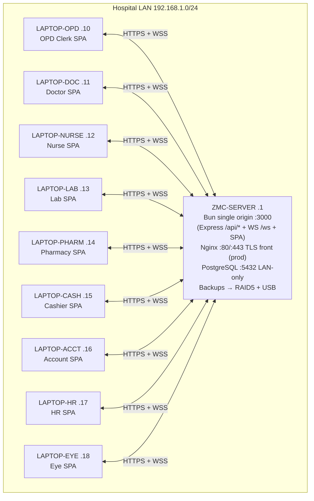
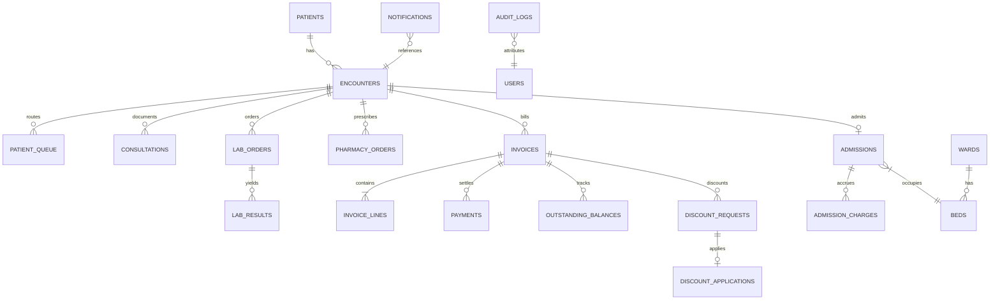
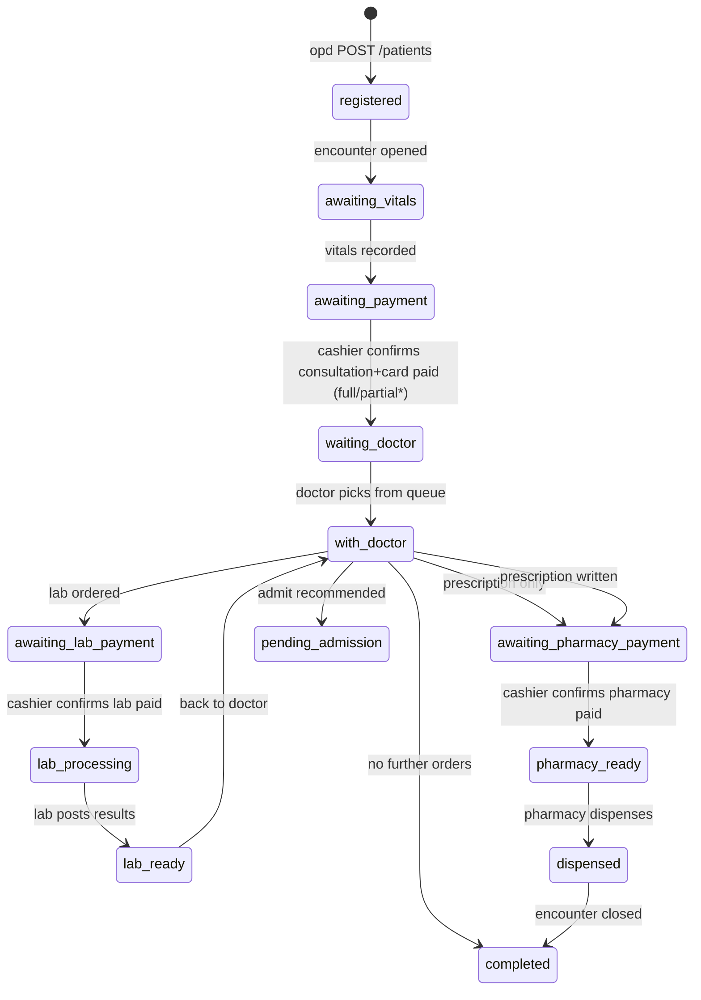
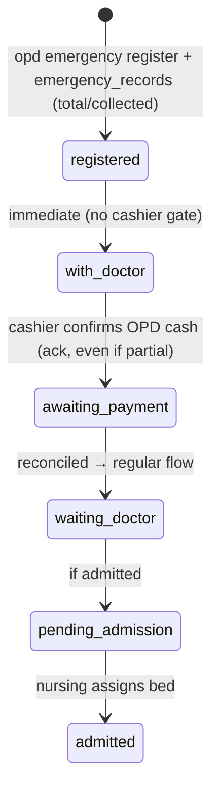
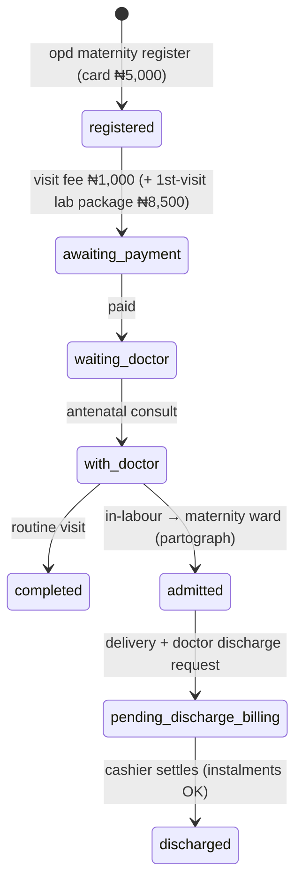
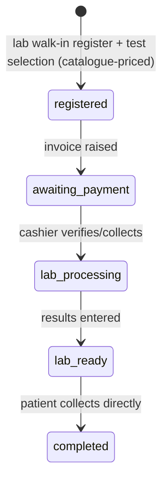
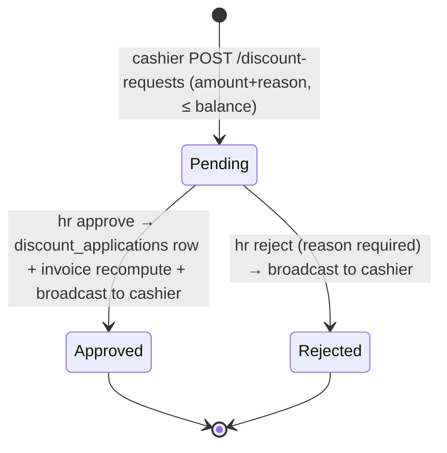
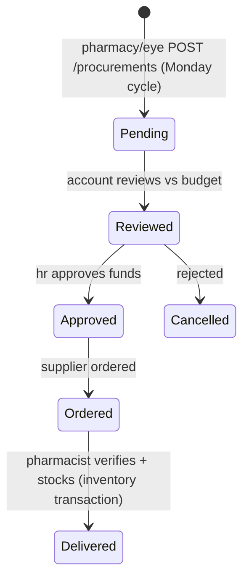
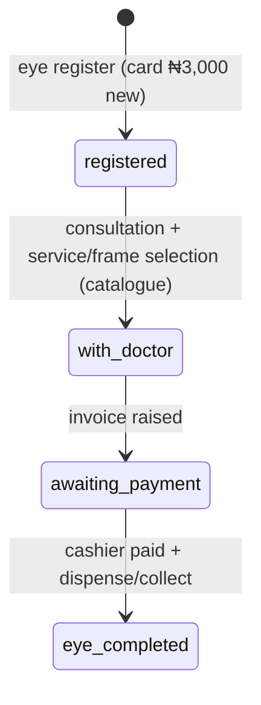

# ZMC EHR — System Design Guide (Production Foundation)

**Version:** 1.1 · **Date:** 2026-10-05 · **Status:** Foundation for production build
**Change note for Version 1.1:** aligned to the repository orchestrator rules — Bun-only runtime, React 19 + Vite 6 + Tailwind 4 + Express 4 + PostgreSQL (`pg`) + JWT + bcrypt + `ws` single-origin stack served by `server.ts` (`/api/*` and `/ws` on one origin); all plan and conflict labels use full descriptive titles (no bare alphanumeric codes); migration and roadmap phases are written out in full with contracts, verification steps, and exit gates.
**Sources (priority order):** (1) `ZMC_EHR_Implementation_Spec.html` (Spec) · (2) `zmc-process-flow.svg` (Flow) · (3) `ZMC_Intranet_Setup_Guide.html` (NetGuide) · (4) `ZMC_EHR_Server_Storage_Report_5Years.html` (StorageRpt)
**Current state inspected:** React 19 + TypeScript + Tailwind 4 + Vite 6 frontend; `server.ts` composition entrypoint (Express `/api/*` mounts before Vite middleware, `/ws` upgrade on the same origin, Vite middleware in dev / `dist/` static in prod); `src/backend/*` route/service/repository/validator pattern; `src/backend/database/db.repo.ts` (~2,300 lines: pool, DDL batch, `refreshCache`, seed); `src/backend/middleware/auth.middleware.ts` (`authenticateJWT`, `authorizeRoles`, `isRoleAuthorized`, role equivalents); `src/types.ts`; `zmc_*` PostgreSQL tables via DDL-in-code. All commands in this guide use Bun only (`bun`, `bun run`, `bunx`) — never npm, npx, node, yarn, pnpm, or tsx.
**Target:** Intranet-only HMS on LAN server `192.168.1.1`, 9 department laptops (.10–.18), single Bun origin serving API + WebSocket + SPA, PostgreSQL, no internet at runtime.

Canonical naming used everywhere in this guide (do not rename per-section):

- **Role keys:** `opd` (OPD Clerk), `cashier` (Cashier), `doctor` (Doctor), `lab` (Lab), `pharmacy` (Pharmacy), `nurse` (Nurse), `eyeclinic` (Eye Clinic), `account` (Account Officer), `hr` (HR Manager) + `it_admin` (IT Administrator, maintenance only). Spec Section 1 is authoritative; codebase `types.ts` carries extra legacy labels — only these 10 are permitted at login (see the role-permission matrix section).
- **Money:** integer **kobo** in DB/API (`amount_kobo`). Display formatting `₦` only at UI edge. Never floats.
- **Attribution rule:** every state-changing write stores `created_by / updated_by` (user id + username + role) and `created_at / updated_at`. No silent overwrites of clinical records — append/version (see data model and security sections).
- **Plan labelling rule (orchestrator):** plan items always carry full descriptive titles, never bare alphanumeric codes.

---

## 1. Assumptions and Source Conflicts

### 1.1 Assumptions [ASSUMPTION] (all must hold or be explicitly waived)

1. [ASSUMPTION] Scale targets: ~120 OPD visits/day, ~40 inpatients, ~200 staff, 9 laptops + 1 server. Taken from StorageRpt base assumptions and the brief; used for capacity and roadmap planning.
2. [ASSUMPTION] Single physical central server as per NetGuide hardware section (i7/Xeon 8+ cores, 16 GB min / 32 GB recommended, 2×1 TB SSD RAID1 + 4×2 TB HDD RAID5 in one chassis, APC 1500VA, Ubuntu Server 22.04, TP-Link SG1016D 16-port switch, CAT6, EAP225 AP). StorageRpt "3-server" is treated as 3 *copies/tiers*, not 3 physical hosts (see storage reconciliation section).
3. [ASSUMPTION] No internet at runtime. Build/patch media arrives via USB/scp from the dev machine. No cloud-only service in the core path. NTP is served from the LAN server [ASSUMPTION — NetGuide does not specify NTP].
4. [ASSUMPTION] All fee **amounts** come from Flow (per brief). Spec text wins on *workflow order*; Flow wins on *prices*.
5. [ASSUMPTION] Power/network can fail at any time. UPS covers short outages only (~15–45 min depending on load [VERIFY — confirm UPS runtime under full load]). Design assumes graceful degrade to paper + spool, never silent loss (see reliability section).
6. [ASSUMPTION] Team = 2 developers. No microservices, Kubernetes, or event sourcing. Single Express monolith + single PostgreSQL database + single WebSocket hub inside one Bun process.
7. [ASSUMPTION] Browsers are evergreen Chrome/Edge on department laptops. Primary use is desktop/kiosk; mobile is best-effort.
8. [ASSUMPTION] Patient identity is hospital-number based (`REG/EMG/MAT/LD/EYE-…`); no biometric, no HMO/insurance in the minimum viable product (listed as future in Spec developer notes).
9. [ASSUMPTION] One active **encounter** per patient at a time for outpatient flows; admissions open a separate inpatient episode linked to the same patient (see data model section).

### 1.2 Source Conflicts (higher-priority source wins; loser noted + resolution)

| Conflict | Sources | Winner and resolution |
|----------|---------|----------------------|
| Conflict — Clinical card fee versus consultation fee: Flow prices a Clinical Card at ₦3,000 (+ Maternity card ₦5,000, Eye card ₦3,000); the Spec registration form only mentions the auto-added ₦5,000 consultation fee (`CONSULTATION_FEE = 5000`). | Spec (priority 1) versus Flow (priority 2) | **Both apply (no true contradiction once combined):** registration creates *two* line items where applicable — card fee (3,000; maternity 5,000; eye 3,000) + consultation fee (5,000). Amounts come from Flow. The Spec constant moves to the server-side fee catalogue (see billing logic section). |
| Conflict — Discount effect manual versus automatic: Spec developer notes say HR approval does **not** modify the payment (cashier applies it manually); Flow says "Bill reduced automatically / instantly reflected". | Spec (priority 1) versus Flow (priority 2) | **Spec wins as-built; design fixes to Flow behaviour:** approval writes an immutable `discount_applications` row and recomputes the invoice balance server-side (see billing logic section). Manual-only application is rejected as a data-integrity risk. Flagged as an intentional change. |
| Conflict — Discharge absorption marking: Spec developer notes say on discharge all pending payments are marked `paid` (absorbed) into one `DISCH-` bill. Flow says "Ward charges + Previous balance". | Spec (priority 1) versus Flow (priority 2) | **Spec wins on mechanism; Flow clarifies intent:** absorbed rows are NOT marked `paid` (that destroys audit). Instead they are linked (`discharge_invoice_id`) with status `AbsorbedIntoDischarge` (new enum value, append-only). See billing logic section. |
| Conflict — Eye Clinic money path: Spec developer notes say eye charges live in separate `eye_clinic_records` localStorage, not main payments; Flow says "Patient pays to Cashier; returns with proof". | Spec (priority 1) versus Flow (priority 2) | **Spec wins as-built; design unifies:** eye charges become standard invoices/line-items payable at Cashier (see data model and billing logic sections). The separate ledger is retired in migration (see migration plan section). |
| Conflict — Server count: StorageRpt demands a 3-server redundant architecture (Primary + On-site Backup + Off-site/Cloud); NetGuide mandates 1 central server, physically isolated, no internet. | NetGuide (priority 3) versus StorageRpt (priority 4) | **NetGuide wins.** "3-server" is reinterpreted as 3 *copies*: (a) primary RAID1 SSDs, (b) on-site backup RAID5 HDDs in the same chassis + external USB/NAS in a locked second room, (c) encrypted off-site **offline** media (rotated USB HDD), not cloud. Cloud is non-compliant with the no-internet constraint. |
| Conflict — Hardware versus storage size: StorageRpt provisions 133 GB × 3 = 400 GB; NetGuide provides ~1 TB usable primary + ~6 TB usable backup. | NetGuide (priority 3) versus StorageRpt (priority 4) | **No conflict after reconciliation** — hardware exceeds the 5-year need by a wide margin (see storage reconciliation section). No hardware change; "133 GB" is a logical allocation, not a physical purchase. |
| Conflict — Insecure sample server code: the sample `server.js` in NetGuide uses hardcoded secrets, `SELECT *`, dynamic `SET` column interpolation (SQL injection), and plain `http://`/`ws://`, plus `8.8.8.8` DNS and an external gateway (implies internet). | Guardrails versus NetGuide (priority 3) | **Guardrails win. All insecure patterns are banned** and replaced in the API design and security sections. External DNS/gateway are corrected to LAN-only (no external DNS at runtime). |
| Conflict — Application runtime Node with PM2 versus Bun single origin: NetGuide installs Node 20, `npm install`, and PM2 with API on port 3000 and WebSocket on port 3001; the repository orchestrator mandates Bun only with a single origin (`bun server.ts`, API and WebSocket on one port). | Repository orchestrator versus NetGuide (priority 3) | **Orchestrator wins for the application runtime.** The app runs under Bun as a single origin: `bun run dev` (`bun server.ts`) in development, `bun run start:production` (`bun dist/server.cjs`) in production, with `/api/*` and `/ws` on the same port. NetGuide's Node/PM2/split-port sample is superseded; systemd (not PM2) supervises the Bun process on the server. System packages via `apt` are unaffected. |
| Conflict — After-hours definition: the Flow emergency box says "After hours (8am–6pm)" — inverted/ambiguous. | Flow internal | **Flagged ambiguous.** Design assumes After-hours = *outside* 08:00–18:00 [ASSUMPTION]. No surcharge amount is given, so no auto-surcharge; record the flag only. See billing logic section and the open-questions list. |
| Conflict — Dual lab prices: LFT ₦12,000/₦15,000; SEUC ₦12,000/₦15,000. No rule for which applies. | Flow internal | **Flagged.** The catalogue stores both as separate SKUs with explicit names; the doctor must pick one. No silent default (see billing logic section). |
| Conflict — Role list width: `types.ts` lists 17 roles (including Administrator, Management, Receptionist, Records Officer, Laboratory Scientist); Spec lists 9 operational roles plus the HR discount role. | Spec (priority 1) versus code | **Spec wins, with a compatibility allowance.** Production login allows the 9 operational roles + `it_admin` (+ optional read-only `auditor`). Legacy labels are retired or aliased through the existing role-equivalence helper (intentional, audited — see role-permission matrix section). |
| Conflict — Unlinked side ledgers: nursing dispensing/injection records + eye records live in their own localStorage keys, unlinked to patients (Spec developer notes). | Spec internal | **Accepted as an as-built gap; design links all records to patient + encounter** with foreign keys (see data model and migration plan sections). |
| Conflict — TLS gap: NetGuide firewall opens 443 (HTTPS) but only documents HTTP deployment; no certificate process. | NetGuide internal | **Gap fixed in the security section:** LAN TLS via a private certificate authority + Nginx termination; HSTS + redirect. Plain HTTP is banned for production. |
| Conflict — Doctor on-call fee scope: "Doctor on-call fee ₦5,000" is listed under the Emergency Fee Schedule — unclear whether additive per emergency or conditional. | Flow internal | **Assumed additive when `is_doctor_on_call=true`** [ASSUMPTION]. Recorded as a separate line item, never folded silently (see billing logic section). |

---

## 2. Architecture overview

**Decision — single Bun origin: Express API + co-located WebSocket hub + PostgreSQL, with Nginx as the optional TLS/static front on the same LAN server.**
*Reason:* 2 developers, ~120 visits/day, single site, no internet. One process means one backup unit, trivial transaction boundaries (API write + notification insert + broadcast in one place), and the repository already implements this shape (`server.ts` serving `/api/*` and `/ws`, Vite middleware in dev, `dist/` static in prod).
*Alternative considered:* separate API / WebSocket / auth services, Kubernetes, event sourcing — rejected: the numbers do not justify it; it multiplies failure modes and backup complexity for a 2-developer team.



Request path (development): Browser → `http://localhost:3000` → Bun `server.ts` (Express routes under `/api/*` mounted BEFORE Vite middleware; `/ws` upgrade on the same port; Vite middleware serves the SPA).
Request path (production): Browser → Nginx `:443` (TLS, static SPA or proxy) → Bun origin `localhost:3000` (`/api/*`, `/ws`) → Express (authentication, validation, transactions) → PostgreSQL (single database). The WebSocket hub publishes role-targeted events; the `notifications` table is the durable counterpart (see real-time notifications section). No outbound internet in the core path; NTP/DNS are LAN-local.

---

## 3. Component responsibilities

| Component | Owns | Must NOT own |
|-----------|------|--------------|
| **SPA (React 19 + Vite 6 + Tailwind 4, per-role views)** | Rendering; form validation mirroring the server; token storage (`zmc_token` + `zmc_user` in localStorage) with expiry check; single `socketManager` subscription with 4-second reconnect; all server calls through `apiFetch` only (`src/utils/api.ts`) — never raw `fetch()`, never hardcoded origins; optimistic UI reconciled against server truth | Price maths, status transitions, authorisation decisions. Never trusts localStorage data for truth post-migration. |
| **`server.ts` (composition entrypoint only)** | Wiring: Express JSON parsing, CORS allowlist, `/api/*` route mounts (before Vite/static middleware), `/ws` upgrade handling, dev Vite middleware vs prod `dist/` static, health endpoint. kept thin — extract any growing logic to modules on touch | Business logic, SQL, long inline endpoint handlers (the maintenance and audit-log handlers currently inline here must be extracted to modules when next touched). |
| **Express API (`/api/*`, versioned as `/api/v1`)** | JWT authentication, RBAC authorisation, whitelist validators, transactional billing/state-machine enforcement, server-owned catalogue pricing, audit-log writes, WebSocket fan-out after each mutation via `ws.util` broadcast | Direct SQL string building (parametrised repository layer only), PHI in logs, secrets in code. |
| **PostgreSQL 15+ with `zmc_*` tables** | System of record; foreign keys, CHECKs, unique invoice/receipt numbers, `*_kobo BIGINT CHECK (>=0)`, queue-repair support, `ANALYZE` maintenance | Business-rule branching (kept in the service layer for testability; the database enforces invariants). |
| **In-memory `dbCache` + `refreshCache()`** | Read accelerator for list screens (existing dual model: Postgres primary, cache second). Full per-table SELECT with snake_case→camelCase mapping on refresh; queue-repair UPDATEs run inside refresh. New reads must paginate (full-table load will OOM at scale) with indexes on `patient_id` / `encounter_id` / `status`. Every new column must extend the refresh mapping or it is invisible to the UI. | Durability or write authority — writes go to Postgres first, then refresh. |
| **WebSocket hub (`ws` lib, same origin `/ws`)** | Authenticated sockets (token via `?token=` query plus `{type:'AUTH', token}` payload; replies `AUTH_SUCCESS` / `AUTH_EXPIRED`), role-targeted broadcast, single `socketManager` singleton on the client, unread-pull replay of missed `notifications` on rejoin | Durability (the database is durable; the socket is ephemeral). |
| **Backup agent (cron + script)** | `pg_dump -Fc` daily 02:00 → RAID5 + verify (`pg_restore --list` + checksum) + 30-day rotation (password via `PGPASSFILE`, never CLI); weekly full copied to encrypted rotated USB; monthly restore drill to staging with logged evidence | Application code. |
| **Seed/Migration handling** | DDL batch in `db.repo.ts` `initializeDatabase` (`CREATE TABLE IF NOT EXISTS` + idempotent `ALTER TABLE ... ADD COLUMN IF NOT EXISTS`; never destructive renames — there is no migration runner by design); idempotent catalogue backfill (lab/meds/eye from `src/backend/catalogue/*`); seeding (`seedDatabase`, `POST /api/db-test/seed`, auto-seed when patients = 0) contains demo PHI and is blocked in production without written approval | Runtime business logic. |

File-size discipline (orchestrator): prefer editing existing files; split files over 500 lines when touching them. Known oversize files: `db.repo.ts` (~2,300 lines), backend domain routes (nursing ~2,400 lines, payments ~1,600, HR ~1,000, exports ~870 — split by domain on touch), frontend views (OPD registration ~245 KB, Doctor ~247 KB, Cashier ~217 KB — extract hooks/components on touch).

---

## 4. Data model: entities, keys, relationships, status enums

**Keys:** UUIDs (`crypto.randomUUID`, stored as `VARCHAR(100)`) as primary keys, matching the existing `zmc_*` schema; human-facing numbers (`hospital_number`, `maternity_number`, `invoice_number`, `receipt_number`) are separate UNIQUE columns with server-side sequences. **Money:** all `*_kobo BIGINT NOT NULL CHECK (>=0)`. **Clinical immutability:** `consultations`, `vitals`, `observations`, `lab_results`, `medication_administrations` are INSERT-only (no UPDATE/DELETE except an IT-admin correction workflow with `supersedes_id` + reason; history preserved). **Legacy-float rule:** existing `NUMERIC`/`DECIMAL` money columns are backfilled to `*_kobo BIGINT` during migration with round-half-up and a reconciliation report (see migration plan).

### 4.1 Core tables (existing `zmc_*` names kept; additions marked NEW)

| Table | PK / Uniques | Key FKs | Purpose |
|-------|--------------|---------|---------|
| `zmc_users` | `id` PK, `username` UNIQUE | — | Staff login; `password` holds the bcrypt hash at steady state (legacy seed rows are plaintext and are migrated on write, never logged), `role`, `department`, `status`, `last_login`, `created_at`, `created_by` |
| `zmc_patients` | `id` PK, `hospital_number` UNIQUE, `maternity_number` UNIQUE NULL | — | Demographics; `card_type`, `status` (current outpatient-level status); next-of-kin + brought-in-by columns for patients unable to provide details |
| `zmc_patient_vitals` | `id` PK | `patient_id→zmc_patients`, `encounter_id→zmc_encounters` | Append-only triage/inpatient vitals + `recorded_by` |
| `zmc_maternity_records` | `id` PK | `patient_id`, (`encounter_id` NEW) | Gravida/para/LMP/EDD/tribe/occupation/abortion/premature (append-only) |
| `zmc_emergency_records` | `id` PK | `patient_id`, (`encounter_id` NEW) | Flags (sick/unbooked-labour/accident/doctor-on-call/after-hours) + `total_bill`/`cash_collected` (migrated to kobo) + `doctor_on_call_name` |
| `zmc_encounters` | `id` PK | `patient_id→zmc_patients` | One visit/episode; `visit_number`, `visit_type`, `destination_clinic`, `priority`, `payment_status`, `clinical_status`, `created_by/at`, `closed_at` |
| `zmc_patient_queue` | `id` PK | `encounter_id`, `patient_id` | Routable queue rows: `queue_type`, `status` (`Waiting/InProgress/Done/Skipped`); subject to the queue-repair UPDATEs in `refreshCache` |
| `zmc_consultations` | `id` PK | `patient_id`, `encounter_id`, `doctor_id→zmc_users` | Notes/diagnosis/plan, `prescriptions JSONB` snapshot + normalised medication orders |
| `zmc_laboratory_orders` / `zmc_laboratory_results` | `id` PK | `patient_id`, `encounter_id`, `doctor_id`; results→orders | Order (`test_code`, snapshotted `price_kobo`, `category`) / result (append-only `result_details`, `findings`) |
| `zmc_pharmacy_orders` | `id` PK | `patient_id`, `encounter_id`, `prescribed_by` | `items JSONB` + status; `medication_code`, dosage/frequency/duration |
| `zmc_invoices` | `id` PK, `invoice_number` UNIQUE (NEW constraint) | `patient_id`, `encounter_id` | Header; `total_kobo` (NEW, replaces `amount`), `paid_kobo` maintained from payments, `balance_kobo` generated, `status` |
| `invoice_lines` (NEW) | `id` PK | `invoice_id`, catalogue ref | One billable: card/consult/lab/pharmacy/ward/procedure/eye; `qty`, `unit_price_kobo`, `line_total_kobo`, `absorbed_into_discharge_id` NULL |
| `zmc_payments` | `id` PK, `receipt_number` UNIQUE (NEW constraint) | `patient_id`, `encounter_id`, `invoice_id` | Each cash receipt; `amount_kobo` (migrated), `method`, `collected_by`; never negative (refunds are reversal rows) |
| `zmc_lab_payments` | `id` PK | `patient_id` (+ `encounter_id`, `invoice_id` NEW links) | Denormalised lab receipt (patient name, tests summary) for the cashier walk-in flow |
| `zmc_outstanding_balances` | `id` PK | `patient_id`, `encounter_id`, `invoice_id` | Current owing per invoice (`total_bill`, `amount_paid`, `balance` migrated to kobo) + `status` (`Owing/PartiallyPaid/Cleared`, `cleared_by/at`) |
| `discount_requests` (NEW table; replaces `discounts` policy list usage for flow) | `id` PK | `patient_id`, `encounter_id`, `invoice_id` | `requested_amount_kobo`, `reason`, `status`, `reviewed_by/at`, `rejection_reason` |
| `discount_applications` (NEW) | `id` PK | `discount_request_id`, `invoice_id` | Immutable applied discount (`amount_kobo`) — created only on HR approval |
| `zmc_discounts` (existing, kept) | `id` PK | — | Discount *policies* (STAFF50, FAMILY30, SENIOR20, EYE40, CORP15), HR-owned; distinct from per-bill requests above |
| `zmc_admissions` | `id` PK | `patient_id`, `encounter_id` | Ward/bed, next-of-kin, religion, detention flag, admit/discharge timestamps |
| `zmc_wards` / `zmc_beds` | `id` PK | `beds.ward_id→wards`, `beds.current_admission_id` | Bed census; assignment is transactional (no double-booking) |
| `zmc_discharges` | `id` PK | `patient_id`, `admission_id` | Discharge record; links to the `DISCH-` invoice |
| `nursing_observations` (NEW) | `id` PK | `patient_id`, `admission_id` | Append-only nursing notes (replaces unlinked localStorage dispensing/injection logs with linked rows) |
| `medication_administrations` (NEW) | `id` PK | `patient_id`, `admission_id`, `order_id` | Dose + time + administering nurse |
| `admission_charges` (NEW) | `id` PK | `admission_id`, `invoice_line_id` | Ward/procedure/consumable charges feeding the discharge bill |
| `zmc_inventory` / `zmc_suppliers` / `zmc_procurements` (+ `procurement_lines` NEW) | `id` PK | lines→procurements/suppliers | Stock + multi-item orders; status lifecycle |
| `zmc_employees` / `zmc_absences` / `zmc_job_openings` / `zmc_candidates` / `employee_documents` (NEW metadata) | `id` PK | absences/candidates/docs → employees/openings | HR domain; documents stored as file references, not blobs |
| `zmc_notifications` | `id` PK | `patient_id`, `encounter_id` | Durable event log (`from_role`, `target_role`, `type`, `message`, `read_at`) — the WebSocket mirrors this table |
| `zmc_audit_logs` | `id` PK | `user_id` | Who/what/when/which row (`user_id/name/role`, `action`, `details`, `timestamp`, `ip_address`) — **no PHI in plaintext** (see security section). Note: the 500-row UI cap is pagination, not retention; retention extension is flagged as a compliance risk. |
| `fee_catalogue` (NEW logical group: `lab_tests`, `medications`, `eye_services`, `service_fees`; may start as the existing `src/backend/catalogue/*` seed files promoted to tables) | `code` PK | — | Server-owned prices in kobo; effective-dated (`valid_from/to`) |
| `zmc_pricing_review` (existing, kept) | `id` PK | `patient_id`, `encounter_id` | Unknown codes park here with `kind/code/name/requested_by/status` — never silently priced, never stores amounts |
| `pvs` (NEW; replaces `cashier_pv_entries` localStorage) / `free_treatments` (NEW) | `id` PK | — | Daily Payment Vitae expenses + staff/dependant free-care register |

### 4.2 Status enums (canonical — use exactly)

- `patients.status`: `registered` · `awaiting_vitals` · `awaiting_payment` · `waiting_doctor` · `with_doctor` · `awaiting_lab_payment` · `lab_processing` · `lab_ready` · `awaiting_pharmacy_payment` · `pharmacy_ready` · `dispensed` · `completed` · `pending_admission` · `admitted` · `detained` · `pending_discharge_billing` · `discharged` · `referred_eye` · `eye_completed`
- `encounters.payment_status`: `Unpaid` · `Partial` · `Paid` · `Waived` · `AbsorbedIntoDischarge`
- `encounters.clinical_status`: `PendingVitals` · `PendingConsult` · `InConsult` · `PendingLab` · `PendingPharmacy` · `Done` · `Admitted` · `Discharged`
- `invoices.status`: `Unpaid` · `Partial` · `Paid` · `Discounted` · `AbsorbedIntoDischarge` · `Voided` (void = reversal rows, never delete)
- `discount_requests.status`: `Pending` · `Approved` · `Rejected`
- `procurements.status`: `Pending` · `Reviewed` · `Approved` · `Ordered` · `Delivered` · `Cancelled`
- `queue.status`: `Waiting` · `InProgress` · `Done` · `Skipped`

### 4.3 Entity-relationship diagram (core clinical + billing slice)



> Every entity above is used by at least one API group in the API design section and at least one state machine in the state-machines section. The fee catalogue plus the pricing-review queue prevent silent pricing (see billing logic section).

---

## 5. Migration plan: localStorage prototype to PostgreSQL

**Decision — strangler migration behind the existing route/service/repository/validator pattern, one domain at a time, with verification before cutover.**
*Reason:* 2 developers, live hospital, no data-loss tolerance. Big-bang rewrite risks patient/billing loss.
*Alternative:* full rewrite + bulk import — rejected (unverifiable, no rollback).

Cross-cutting rules for every migration phase below: touch existing files first (split oversize files on touch per the thresholds in the architecture section); every new backend route follows the `constants → validator → repository (parametrised $1, snake_case) → service (transactions) → controller ({success,data}) → routes (authenticateJWT then authorizeRoles)` file pattern; mount new routers in `server.ts` BEFORE the Vite/static middleware; every encounter-scoped write validates that `patient_id` and `encounter_id` belong together; every mutation broadcasts via `ws.util` after commit and writes an audit row for PHI changes; frontend consumes new endpoints through `apiFetch` only; verification for every phase is `bun run lint` with zero new errors plus `bun run dev` smoke on `http://localhost:3000` plus `/api/db-test` row-count comparison.

### Migration Phase — Freeze and inventory the prototype stores

- **Objective:** stop the moving target. Freeze the localStorage keys documented in Spec Section 13 (`hospital_patients`, `hospital_employees`, `hospital_absences`, `hospital_requisitions`, `hospital_candidates`, `hospital_procurements`, `hospital_discount_requests`, `cashier_pv_entries`, `cashier_nocharge_entries`, `eye_clinic_records`, `pharmacy_stock`, `nursing_dispensing`, `nursing_injections`); add an export control that dumps each key to a versioned JSON file.
- **Work items:** inventory script counting rows per key; read-only snapshot stored with the release tag; feature flag introduced for switching each domain from localStorage to API.
- **Cutover gate:** key inventory with row counts signed off by both developers; snapshot restorable in development.

### Migration Phase — Authentication and users on PostgreSQL

- **Objective:** retire "any username + role succeeds". Real bcrypt verification (cost 12), JWT issuance/verification via `src/backend/config/env.ts` (persistent secret ≥ 32 characters, `STRICT_JWT_SECRET=true` in production), 8-hour expiry, `zmc_token` + `zmc_user` session handling with `zmc-logout` reset.
- **Work items:** import the canonical users; force password reset on first login; migrate legacy plaintext seed passwords on write (never log them); wire `authenticateJWT` + `authorizeRoles` on all PHI routes; keep the IT/Administrator/Management bypass only where already present, intentional and audited.
- **Cutover gate:** all 9 operational roles plus IT administration can log in via the API; the trust-model path is disabled behind the feature flag; login rate-limiting active.

### Migration Phase — Patients, encounters, and queue on PostgreSQL

- **Objective:** normalise patient JSON into `zmc_patients` plus child tables (`zmc_patient_vitals`, `zmc_maternity_records`, `zmc_emergency_records`) exactly matching the `refreshCache` mapping already in `db.repo.ts`; open one `zmc_encounters` row per visit with `visit_number`, `visit_type`, `destination_clinic`; route through `zmc_patient_queue`.
- **Work items:** idempotent backfill script with dry-run report; generate `hospital_number` for legacy rows missing it; dedupe candidates by name + date-of-birth + phone go to a human review queue (never auto-merge) [ASSUMPTION]; extend `refreshCache` snake→camel mapping for every new column; preserve the queue-repair UPDATEs.
- **Cutover gate:** outpatient registration → queue → cashier → doctor works end-to-end on PostgreSQL; `/api/db-test` patient/encounter counts match the snapshot.

### Migration Phase — Billing on PostgreSQL (invoices, lines, payments, outstanding, discounts, Payment Vitae)

- **Objective:** convert `amount`/`amountPaid` floats to `*_kobo BIGINT` (round half-up, differences listed in a reconciliation report); rebuild outstanding balances from invoices minus payments (never trust stored balances); import discount requests as request + application rows.
- **Work items:** `invoice_lines` introduced so card, consultation, lab, pharmacy, ward, and eye charges are itemised; sequential `invoice_number`/`receipt_number`; `Idempotency-Key` support on payment posts; Payment Vitae moved from `cashier_pv_entries` to the `pvs` table.
- **Cutover gate:** balance reconciliation report shows zero unexplained kobo; Cashier pending/outstanding/discharge views read from PostgreSQL; duplicate payment retry returns the same receipt.

### Migration Phase — Clinical records on PostgreSQL

- **Objective:** consultations, lab/pharmacy orders and results, nursing observations and administrations, admissions/beds/charges — all linked to patient + encounter with the linkage validator.
- **Work items:** link orphan `eye_clinic_records`, `nursing_dispensing`, and `nursing_injections` entries to patient + encounter; unmatched rows go to a linkage-review list with a UI (same pattern as the pricing-review queue); unknown lab/medication codes go to `zmc_pricing_review` with HTTP 422, never a silent fallback price; bed assignment and stock decrement run in transactions (`409` on bed taken / stock short).
- **Cutover gate:** spot-check of 50 encounters end-to-end passes; Doctor, Lab, Pharmacy, and Nurse views run on PostgreSQL.

### Migration Phase — Human resources, procurement, and inventory on PostgreSQL

- **Objective:** employees, absences, openings, candidates, procurements (+ lines), suppliers, inventory, and document metadata.
- **Work items:** documents stored as file references with metadata, not blobs (800 KB scans stay on disk with database pointers); procurement multi-line orders with the review → approve → order → deliver lifecycle; row-count parity check.
- **Cutover gate:** HR and Account views run on PostgreSQL; server-generated Excel exports match database totals.

### Migration Phase — Decommission the prototype stores

- **Objective:** remove the read-only localStorage fallback; remove the Reset Demo control from production (or restrict to `it_admin` with typed confirmation, pre-export backup, and audit); block seeding in production without written approval.
- **Work items:** final `pg_dump -Fc` plus restore test; staging sign-off; production cutover per the deployment section; rollback asset is the pre-cutover dump plus the localStorage snapshot.
- **Cutover gate:** staging sign-off recorded; production cutover checklist complete (see deployment section).

**Insecure-pattern fixes applied during migration (note the change):** parametrised queries only (ban dynamic column interpolation — whitelist columns in validators); explicit column lists (ban `SELECT *` in application code); `*_kobo` integers; secrets from environment/files, never code; HTTPS/WSS only; CORS tightened to the intranet origin (fixes permissive `origin:true`).

---

## 6. API design

**Base:** same-origin `/api/v1` (development `http://localhost:3000/api/v1`; production `https://192.168.1.1/api/v1`). New routers mount in `server.ts` BEFORE the Vite/static middleware. Existing unversioned mounts stay as legacy aliases during transition, then retire. Auth: `Authorization: Bearer <JWT>` (8 hours, LAN-only). Envelope (repository convention): `{success:true, data}` or `{success:false, error, message?, traceId?}` with auth errors from `auth.constants` (`401 UNAUTHORIZED` / `TOKEN_EXPIRED`, `403 FORBIDDEN` — never stack traces or secrets). Pagination: `?page&perPage&sort&order` with total counts. Idempotency: `Idempotency-Key` header on payment and discharge posts. All billing inputs in kobo. Every encounter-scoped write carries `encounter_id` and the service validates that patient + encounter belong together. Every mutation broadcasts via `ws.util` after commit.

**Decision — keep the Express route → controller → service → repository → validator layering already in the codebase.**
*Reason:* matches team muscle memory; testable; minimal churn.
*Alternative:* tRPC/GraphQL — rejected (tooling + offline + 2-developer cost).

### 6.1 Endpoints by module (screen → endpoint trace, with backend contract owner)

| Module (screen) | Endpoints (method, path, core request → response, errors) |
|-----------------|-----------------------------------------------------------|
| Authentication (LoginScreen) | `POST /v1/auth/login` ({username, password} → {token, user}; `401` generic) · `POST /v1/auth/logout` (audit + token denylist until expiry) · `GET /v1/auth/me` · `POST /v1/auth/refresh` (single rotation). Session: `zmc_token` + `zmc_user`; `401` or `AUTH_EXPIRED` clears storage and dispatches `zmc-logout`; App resets to `/` + dashboard. |
| Outpatient registration (Register/Returning/Maternity/Emergency/Admissions views) | `POST /v1/patients` → patient + encounter + queue rows + card/consult invoice lines · `GET /v1/patients?q&cardType&status` (paginated, explicit columns) · `GET /v1/patients/:id?include=vitals,maternity,emergency,encounters,balances` · `PATCH /v1/patients/:id` (whitelisted fields only) · `POST /v1/encounters` · `POST /v1/encounters/:id/vitals` · `POST /v1/encounters/:id/maternity` · `POST /v1/encounters/:id/emergency-cash` ({totalBillKobo, cashCollectedKobo} → invoice + payment + outstanding atomically) · `GET /v1/queue?clinic&status` · `POST /v1/queue/:id/advance` (state-machine guarded; illegal → `422 STATE`). |
| Cashier (Pending/Discharge/Outstanding/Payment Vitae/Discounts) | `GET /v1/invoices?status&patientId` · `GET /v1/invoices/:id` (lines + payments + discounts) · `POST /v1/payments` ({invoiceId, amountKobo, method} → receipt; triggers balance recompute + broadcast) · `GET /v1/outstanding?patientId` · `POST /v1/outstanding/:id/settle` · `POST /v1/pvs` · `GET /v1/pvs` · `DELETE /v1/pvs/:id` (`account`/`it_admin` only, audited) · `POST /v1/discount-requests` · `GET /v1/discount-requests?status` · `POST /v1/free-treatments` (staff/dependant register, separate from discounts). |
| Doctor (Outpatient/Admitted + record sub-tabs) | `GET /v1/queue?queueType=Doctor%20Consultation&status=Waiting` · `POST /v1/consultations` (append-only) · `POST /v1/lab-orders` (catalogue codes only; unknown → `422 UNKNOWN_CODE` + pricing-review row) · `POST /v1/pharmacy-orders` (same rule) · `POST /v1/admissions/recommend` → `pending_admission` · `POST /v1/admissions/:id/request-discharge` (computes bill, creates `DISCH-` invoice, links absorbed lines) · `GET /v1/patients/:id/ehr` (export for Download EHR). |
| Laboratory (Regular/Walk-in) | `GET /v1/lab-orders?status` · `POST /v1/walkin-lab-registrations` (patient stub + encounter + invoice atomically) · `POST /v1/lab-orders/:id/start` · `POST /v1/lab-results` (append-only; order → Completed) · `GET /v1/catalogue/lab-tests`. |
| Pharmacy (Dispense/Admitted/Procurement/Stock) | `GET /v1/pharmacy-orders?status` · `POST /v1/pharmacy-orders/:id/dispense` (transactional stock decrement; short stock → `409`) · `GET /v1/inventory` (paginated) · `PATCH /v1/inventory/:id/adjust` (reason required, audited) · `POST /v1/procurements` (multi-line) · `GET /v1/catalogue/medications`. |
| Nursing (Admitted/Detained/Dispensing/Injections + care tabs) | `POST /v1/admissions/:id/assign-bed` (transactional bed lock; taken → `409`) · `POST /v1/admissions/:id/vitals` · `POST /v1/admissions/:id/observations` · `POST /v1/admissions/:id/administer` · `POST /v1/admissions/:id/charges` (→ invoice line) · `POST /v1/admissions/:id/detain` / `.../process-discharge` · `GET /v1/wards` + `/beds?wardId&free=1`. |
| Eye Clinic (Register/Consult/Records) | `POST /v1/eye/registrations` (unified patient) · `POST /v1/eye/consultations` · `POST /v1/eye/orders` (service + frame catalogue codes) → standard invoice · `GET /v1/eye/records?q`. |
| Account Officer (Overview/Doctors/Lab/Pharmacy/Procurement/Outstanding/Discounts + Excel) | `GET /v1/reports/revenue?groupBy=day,week,month&dept&clinician` · `GET /v1/reports/outstanding` · `GET /v1/reports/discounts` · `GET /v1/reports/procurements` · `GET /v1/exports/transactions.xlsx` (server-generated; client-side workbook generation retired for canonical reports). |
| Human Resources (Dashboard/Employees/Absences/Recruitment/Procurement/Discounts) | `CRUD /v1/employees` (+ `/v1/employees/:id/documents` metadata) · `CRUD /v1/absences` · `CRUD /v1/recruitments/openings` + `/candidates` · `POST /v1/procurements/:id/review` / `/approve` / `/order` / `/deliver` · `POST /v1/discount-requests/:id/approve` / `/reject` (approval creates the immutable `discount_applications` row, recomputes the invoice, and broadcasts to `cashier`). |
| Notifications and WebSocket | `GET /v1/notifications?targetRole&unread=1` · `POST /v1/notifications/:id/read` · `POST /v1/notify` (creates the row + fan-out; internal) · same-origin `/ws` (`?token=` query + `{type:'AUTH', token}` payload → `AUTH_SUCCESS` / `AUTH_EXPIRED`; 4-second reconnect; singleton `socketManager`). |
| Administration and maintenance (`it_admin` only) | `GET /v1/health` · `GET /v1/db-test` (connection config without password, query latency, table counts) · `POST /v1/maintenance/cache-clear` / `/vacuum` (`ANALYZE` + counts only) · `GET /v1/maintenance/backup` (encrypted, audited; the raw full-DB JSON dump is PHI and is never emailed or stored unencrypted) · `POST /v1/maintenance/clear-store` (whitelisted `storeKey` table map only) / `/system-reset` (typed confirmation + second approver + pre-export backup + full audit; staging-only unless the emergency runbook is invoked). |

### 6.2 Authentication, errors, versioning (normative)

- Login: bcrypt compare (cost 12), generic `401` (no user enumeration), JWT claims (`sub/id`, username, role, department) + `jti`, 8-hour expiry, single-use refresh rotation. WebSocket `AUTH` uses the same JWT; expiry yields `AUTH_EXPIRED` and the next API call yields HTTP `401`, and the client clears the session and dispatches `zmc-logout`.
- Authorisation: `authenticateJWT` then `authorizeRoles([...])` on every route (matrix in the role-permission section enforced server-side, never client-only). The IT/Administrator/Management bypass in the authorisation helper stays intentional and audited.
- Validation: whitelist-body validators per route (fixes the NetGuide dynamic-column flaw); unknown lab/medication codes → `422 UNKNOWN_CODE` plus an automatic pricing-review row (never a silent fallback price).
- Errors: `400 VALIDATION` · `401 UNAUTHORIZED` / `TOKEN_EXPIRED` · `403 FORBIDDEN` · `404 NOT_FOUND` · `409 CONFLICT` (bed taken, stock short, duplicate invoice) · `422 STATE` (illegal transition) / `UNKNOWN_CODE` · `429 RATE_LIMIT` · `5xx` with `traceId`, no stack or PHI to the client.
- Versioning: `/api/v1`; a breaking change introduces `/api/v2` with dual-serve during transition; catalogue/fee changes are effective-dated data, not API breaks.
- Frontend contract: views consume these endpoints through `apiFetch` only (which resolves `API_BASE` to `/api` or the build-time backend URL); no raw `fetch()`, no hardcoded origins. Navigation changes touch all three maps (`tabToPathMap` + `pathToTabMap` in `App.tsx`, department navigation + aliases in the navigation config) with `isNavigationAllowed` checked before tab switches and existing aliases preserved.

---

## 7. Role-permission matrix (role × resource × action)

Legend: **C**reate **R**ead **U**pdate **D**elete **A**pprove · `—` denied · `own` = own department/patient scope. The server enforces; the UI hides denied actions. Backend role checks mirror the navigation department keys (minimum-necessary principle).

| Resource | opd | cashier | doctor | lab | pharmacy | nurse | eyeclinic | account | hr | it_admin |
|----------|-----|---------|--------|-----|----------|-------|-----------|---------|----|----------|
| Patients (register/search/update demographics) | CRU | R | R | R (walk-in: CR) | R | R | CRU (eye) | R | — | R |
| Vitals (triage/inpatient) | — | — | R | — | — | CRU* | CRU* (eye vitals) | — | — | R |
| Encounters/Queue advance | CRU | R (advance on pay) | CRU | CRU (lab queue) | R | CRU (admit flow) | CRU | R | — | R |
| Consultations/Notes/Orders | — | — | CRU* | — | — | R | CRU* (eye) | — | — | R |
| Lab orders/results | — (view) | R | C (order) | CRU* (process) | — | R | C/R (eye labs) | R | — | R |
| Pharmacy orders/dispense/stock adjust | — | R | C (prescribe) | — | CRU (+D void w/ audit) | C (administer) | C (eye meds) | R | — | R |
| Invoices/Payments/Outstanding/Payment Vitae | — | CRUD (void w/ audit, no hard delete) | R | R | R | C (ward charges) | R | R | — | R |
| Discharge request / settle-discharge | — | U (settle) | C (request) | — | — | U (process) | — | R | — | R |
| Discount request / approve-reject | — | C (request) | — | — | — | — | C (request eye) | R | A | R |
| Procurement request/review/approve | — | — | — | — | C | — | C (eye supplies) | RU (review) | A | R |
| Employees/Absences/Recruitment/Documents | — | — | — | — | — | — | — | R | CRUD | R |
| Reports/Exports (revenue/performance/outstanding) | — | R (own) | R (own) | R (own) | R (own) | — | R (own) | CRU (exports) | R (HR/procure/discount) | R |
| Audit logs | — | — | — | — | — | — | — | R | — | CRUD (clear dual-approved) |
| Maintenance (backup/clear/reset/vacuum) | — | — | — | — | — | — | — | — | — | C |

`*` = append/version only (no silent edit of clinical rows). `it_admin` never edits clinical/billing content except through the correction workflow with `supersedes_id` + reason + audit.

---

## 8. State machines for every workflow (patient status transitions)

Global rule: all transitions run server-side, guarded by role plus invoice/queue preconditions, and write `audit_logs` + `notifications` + a WebSocket event. Illegal transition → `422 STATE`.

### 8.1 Regular outpatient flow


`*`Partial allowed → `encounter.payment_status=Partial` + `outstanding_balances` row; flow continues (Flow payment-flow panel).

### 8.2 Emergency flow (outpatient collects cash first, doctor immediately)


`emergencyCashConfirmed=true` means *acknowledged*, not *fully paid* (Spec developer notes). The balance flows to Outstanding Balances.

### 8.3 Maternity and antenatal flow



### 8.4 Walk-in lab flow



### 8.5 Admission, discharge, and detention flow

```mermaid
stateDiagram-v2
  [*] --> pending_admission: doctor recommends
  pending_admission --> admitted: nurse assigns ward+bed (transaction lock)
  pending_admission --> detained: observation only (no bed)
  detained --> admitted: formal admit
  detained --> completed: released from observation
  admitted --> pending_discharge_billing: doctor request-discharge (bill computed, DISCH- invoice, lines linked not deleted)
  pending_discharge_billing --> discharged: cashier settles (full; partial stays Owing but patient may remain pending per policy — see billing logic section)
  discharged --> [*]
```


Daily loop while `admitted`: vitals → medications → observations → doctor review → charges (each append-only).

### 8.6 Discount approval flow



### 8.7 Procurement flow



### 8.8 Eye clinic flow



---

## 9. Real-time notifications: events, channels, delivery guarantees

**Channel:** same-origin WebSocket `/ws` over TLS in production (the NetGuide plain-`ws://` sample is fixed to `wss://`). Authentication: `?token=` query plus `{type:'AUTH', token}` payload on open → `AUTH_SUCCESS` / `AUTH_EXPIRED`. Client: singleton `socketManager`, 4-second reconnect, and resynchronisation via `GET /v1/notifications?unread=1` (covers missed frames). Durability: every fan-out first INSERTs the `notifications` row transactionally with the domain write, then broadcasts; the socket is ephemeral, the database is truth. Expired sessions clear storage and dispatch `zmc-logout` so the app resets to `/` + dashboard.

| From → To | Event `type` | Trigger (API transaction) |
|-----------|--------------|---------------------------|
| opd → cashier | `CONSULT_PAYMENT_DUE` | encounter opened / emergency-cash recorded |
| cashier → doctor | `PATIENT_READY` | consultation/card payment confirmed |
| doctor → cashier | `LAB_PAYMENT_DUE` / `PHARMACY_PAYMENT_DUE` | lab/pharmacy order created |
| cashier → lab | `LAB_READY_TO_PROCESS` | lab payment confirmed |
| lab → doctor | `LAB_RESULTS_READY` | results posted |
| cashier → pharmacy | `DISPENSE_DUE` | pharmacy payment confirmed |
| pharmacy → nurse/doctor | `DISPENSED` | dispensed/administered |
| doctor → nurse | `ADMISSION_PENDING` | admit recommended |
| nurse → doctor | `ADMITTED` | bed assigned |
| doctor → cashier | `DISCHARGE_BILL_READY` | request-discharge (`DISCH-` invoice) |
| cashier → nurse | `DISCHARGE_SETTLED` | discharge settled |
| lab → cashier/doctor | `WALKIN_PAYMENT_DUE` / `WALKIN_RESULTS_READY` | walk-in invoice / results |
| cashier → hr | `DISCOUNT_REQUESTED` | discount requested |
| hr → cashier (+account log) | `DISCOUNT_DECIDED` | approve/reject |
| pharmacy → account/hr | `PROCUREMENT_SUBMITTED` / `REVIEWED` / `APPROVED` / `DELIVERED` | submit/review/approve/deliver |

**Guarantees:** at-least-once delivery (database row + broadcast + unread-pull on reconnect); ordering per encounter via `encounter_id` + `created_at` sequence; no PHI in payloads beyond patient id, display name, and message, always over TLS; toast plus optional audio on the client; `read_at` tracking per role.

---

## 10. Billing logic (normative — all amounts kobo)

**Fee catalogue (from Flow; stored server-side, effective-dated, admin-editable with approval):**

| Item | Amount (₦) | Notes |
|------|-----------|-------|
| Clinical Card (regular) | 3,000 | per new registration |
| Consultation Fee | 5,000 | auto-added; partial payment allowed |
| Maternity Card (clinical + maternity) | 5,000 | replaces the regular card for maternity |
| Maternity Visit Fee | 1,000 | per antenatal visit |
| First-visit Lab Package (VDRL, HP, MP, RVS, UA) | 8,500 | bundled SKU, not the sum of parts |
| Emergency: Sick / Unbooked Labour / Accident | 25,000 / 50,000 / 50,000 | Outpatient records Total / Collected / Balance |
| Doctor on-call fee | 5,000 | additive when `is_doctor_on_call` is true [ASSUMPTION] |
| Lab: MP Standard 3,000 · MP Comprehensive 5,000 · Widal 5,000 · Urinalysis 3,000 · FBC 7,000 · Hb 3,000 · FBS/RBS 2,000 · LFT basic/full 12,000/15,000 (two SKUs, explicit pick — see the dual-price conflict) · SEUC basic/full 12,000/15,000 (two SKUs, explicit pick) · PSA 15,000 · HBA1c 10,500 · Hormonal Profile 90,000 · Cholesterol 10,000 · Total Bilirubin 7,000 · RVS 5,000 · HbsAg 3,500 · Syphilis 3,500 · Blood Group 3,000 · Genotype 10,000 · Cross Matching 10,000 · Culture and Sensitivity 18,000 · Sputum Analysis 18,000 · HP 5,000 | as listed | unknown codes → HTTP 422 + pricing-review row |
| Eye: Card 3,000 · Visual Acuity 1,000 · Auto Refraction 5,000 · Tonometry 5,000 · CVF 10,000 · Slit Lamp 10,000 · Ophthalmoscopy 1,000 · Frames 15,000/20,000/35,000 · Irrigation 5,000 · Foreign Body Removal 10,000 · Dilation 2,000 | as listed | unified invoice (see the eye-money conflict resolution) |

**Rules:**

1. Invoice = header + immutable lines (`qty × unit_price_kobo`). `total_kobo` = sum of lines − sum of applied discounts. `paid_kobo` = sum of payments (trigger-maintained). `balance` = total − paid. Partial payment is always allowed (Flow); each receipt is a separate `payments` row with a sequential `receipt_number`; the outstanding row is updated, never deleted until `Cleared`.
2. Instalments (2nd/3rd visits) post to the same `invoice_id` with idempotency keys; overpay → `409` (or a credit-note row [ASSUMPTION — policy choice, default is to reject overpay]).
3. Discounts: request ≤ balance, reason required; HR approval creates the immutable `discount_applications` row and recomputes the invoice server-side (see the discount-effect conflict resolution); rejection needs a reason; all discounts appear in the Account Discounts Register; free treatments (staff/dependants/MD relatives) use the separate `free_treatments` register, not the discount flow.
4. Discharge bill = sum of open `admission_charges` + sum of linked prior unpaid invoice balances (linked via `absorbed_into_discharge_id`, status `AbsorbedIntoDischarge` — never marked `Paid`; see the discharge-absorption conflict resolution). The `DISCH-<seq>` invoice appears in Cashier Discharge Bills; `patient.status=pending_discharge_billing` until settled; only then `discharged`. Partial discharge payment keeps the status pending (policy default; configurable threshold [ASSUMPTION]).
5. Payment Vitae: daily expenses, `approved_by` defaults to Doctor, deletable only by `account`/`it_admin` with audit plus totals footer.
6. Unknown lab/medication/eye code → `422` + `pricing_review_queue` row; the cashier cannot price manually. The catalogue backfill owns prices.
7. Display: `₦5,000.00` renders from `500000` kobo via a single `formatKobo()` helper; the API never accepts naira floats.

---

## 11. Security

**Decisions (each fixes a NetGuide-sample flaw — note the change):**
- **Secrets:** environment/files (root-only `600` permissions, e.g. systemd `EnvironmentFile`); never in code or logs; JWT secret persistent and ≥ 256-bit random; separate database password and JWT secret; `STRICT_JWT_SECRET=true` in production to fail fast when missing; rotation runbook. *(Fixes hardcoded sample secrets. Keep `JWT_SECRET` out of logs; verify no secrets in git history with `.gitignore` covering `.env`.)*
- **Transport:** Nginx TLS with a private LAN certificate authority (distribute the CA to the 9 laptops once) + `wss://`; HSTS; HTTP→HTTPS redirect. *(Fixes plain `http/ws`.)*
- **Application hardening:** `helmet`-equivalent headers; rate-limit on `/api/auth/login` and `/api/verify-identity`; `express.json` size limit; CORS allowlist restricted to the intranet origin (fixes permissive `origin:true`). *(New versus NetGuide sample.)*
- **Database:** parametrised queries + whitelist validators only *(fixes dynamic column interpolation)*; explicit column lists *(fixes `SELECT *`)*; `pg_hba` LAN-only (`md5`/`scram`), `listen_addresses` bound to the intranet IP; application role least-privilege (no SUPERUSER/DDL at runtime); `ANALYZE` via the vacuum endpoint.
- **Passwords:** bcrypt hash/compare only (cost 12); the seed's legacy plaintext passwords are migrated on write and never logged; generic login errors; lockout after 5 failures/15 minutes + audit; first-login reset; 8-hour JWT + single-use refresh; WebSocket re-authentication on expiry.
- **Sessions:** token pair in localStorage (`zmc_token` + `zmc_user`) is XSS-sensitive — sanitise renders, no token/PHI in console; expiry check on load; server-side denylist (`jti`) until expiry on logout; idle warning 15 minutes before expiry [ASSUMPTION]; no concurrent-session ban (ward usability) but audit each login; `401`/`AUTH_EXPIRED` clears the session and dispatches `zmc-logout`.
- **Audit:** append-only `zmc_audit_logs` (service writes: user id/name/role, action, details, timestamp, IP — **no PHI plaintext**; details reference IDs). Log every PHI create/update/delete plus every Data Clear and System Reset. `TRUNCATE`/clear requires `it_admin` + typed confirmation + second approver + pre-export. Note the 500-row UI cap is a compliance risk — retention extension is flagged.
- **Backup secrecy:** dumps encrypted before touching USB; filenames without patient identifiers; the maintenance backup download contains full-database PHI — restrict to IT administration, encrypt at rest, never email or store unencrypted.
- **Uploads:** lab attachment cap, file-type allowlist, AV-scan hook [ASSUMPTION].
- **Release gate:** block release on new lint errors or missing audit entries; check dependency CVEs (express/pg/jwt/ws/vite/react) on dependency changes.

---

## 12. Compliance: Nigeria Data Protection Act 2023

> The Act is cited as named in the brief; procedural specifics (filing thresholds, fees, timelines) are marked [VERIFY] with the Nigeria Data Protection Commission.

- **Lawful basis and consent:** treatment contract + explicit consent captured at registration (paper→scan or e-tick + timestamp + staff witness); separate consent for maternity/minor/guardian flows; next-of-kin and brought-in-by fields are required for incapacitated patients [ASSUMPTION on wording — legal review required]. Withdrawal path documented; withdrawal does not equal deletion of the clinical safety record (retention overrides with justification logged).
- **Rights:** access, correction (via the `supersedes` correction, original retained), deletion where retention permits, objection; fulfilled via `it_admin` + Data Protection Officer within the statutory window [VERIFY days].
- **Minimisation and secrecy:** the role matrix (role-permission section) is the access-control evidence with backend roles matching navigation department keys; `SELECT *` ban, PHI-free logs, encrypted backups/USB, locked server room (NetGuide), 5-minute screen-lock policy [ASSUMPTION]; frontend clears tokens and PHI views on `401`/`AUTH_EXPIRED`.
- **Retention:** active clinical 5 years online (matches the StorageRpt horizon) + [VERIFY — hospital record rules may require longer, e.g. 10 years]; audit logs 5 years (note the 500-row UI cap is display-only); HR documents per employment + 3 years post-exit [ASSUMPTION — confirm with counsel]; then secure archive (encrypted offline) or certified destruction with a log.
- **Breach:** internal 24-hour triage + contain + assess; regulator/data-subject notification per Commission timelines [VERIFY]; logged as an incident with post-mortem.
- **Roles:** designate a Data Protection Officer (HR or IT lead dual-hat initially [ASSUMPTION]); processor clauses for suppliers with data access; annual self-audit.

---

## 13. Reliability: backups, restore tests, RAID limits, UPS, failover, outage behaviour

- **Backup (single-server reality):** `pg_dump -Fc` daily 02:00 → `/mnt/backup` (RAID5 HDDs) + verify (`pg_restore --list` + checksum) + 30-day rotation (NetGuide cron kept, password via `PGPASSFILE`, not CLI); weekly full copied to encrypted rotated USB (off-site analogue — see the server-count conflict resolution); monthly restore drill to staging with logged evidence. WAL archiving enabled for point-in-time recovery *within* the node [ASSUMPTION — documented as best-effort, not high availability].
- **Maintenance safety order (existing `server.ts` endpoints):** backup first (backup download contains PHI — encrypt and record the actor); prefer cache-clear, then single-key clear-store, then system-reset last — never system-reset or seed in production without written approval. The clear-store `storeKey` whitelist (table map) governs impact — e.g. `patients` cascades to emergency/maternity/vitals/queue/consultations/pharmacy/lab/payments/invoices/encounters; confirm cascade impact before running. Rollback = restore the backup JSON / re-seed + `refreshCache`.
- **RAID limits (stated plainly):** RAID1 survives 1 SSD failure; RAID5 survives 1 HDD failure — **not backup** (fire/theft/ransomware/accidental `TRUNCATE` need the USB + dumps). Rebuild windows are degraded/slow — monitor (`mdadm`, SMART). Annual disk-replacement budget.
- **UPS:** APC 1500VA covers graceful shutdown, not continued clinic [VERIFY runtime]. `apcupsd` → automatic checkpoint + service stop + OS halt on low battery. Quarterly discharge test.
- **Failover:** no automatic failover (single node). Recovery Time Objective ≤ 4 hours (spare PSU/disk + USB restore), Recovery Point Objective ≤ 24 hours (daily dump) — posted in the ward runbook [ASSUMPTION targets]. Warm spare laptop imaged as an emergency read-only viewer [ASSUMPTION].
- **Outage behaviour:** network drop → SPA banner, WebSocket reconnect loop (4-second backoff), API calls surface retry (no silent queuing of billing writes by default — the cashier must not "remember and retype"; instead LAN-redundant cable + access-point failover). Server down → paper fallback forms (pre-printed encounter/billing sheets with numbering) + next-day back-entry with `back_entered=true` + dual verification. Power loss mid-payment → payment commits or rolls back atomically (database transaction); receipt printed only after commit; duplicate print uses the same `receipt_number` (idempotent).

---

## 14. Storage and capacity: reconcile StorageRpt with NetGuide hardware

StorageRpt maths (accepted): raw 78.25 GB/5 years → +25% PostgreSQL overhead = 97.81 GB → ×3 copies = 293.44 GB → +20% growth = **400 GB logical**. Largest drivers: lab attachments 13.70 GB + audit/event logs 18.26 GB + indexes 10 GB.

NetGuide hardware usable: RAID1 2×1 TB SSD → **~1 TB** primary (OS + PostgreSQL + app); RAID5 4×2 TB HDD → **~6 TB** backup. **Conclusion: hardware exceeds the 5-year need ~2.5× on primary and ~15× on backup — no purchase needed.** Allocate logically: 150 GB database + 50 GB WAL/logs + 100 GB OS/app/snapshots on SSD (rest free for growth/DICOM staging); HDD holds 30 daily + 12 weekly + 12 monthly dumps (~50–150 GB actual, rest free). Re-evaluate at 70% SSD. Excluded (per StorageRpt): DICOM/PACS (+2–10 TB/year if added — separate server then). Database growth guard: new list reads paginate (the `refreshCache` full-table pattern will OOM at scale); add indexes on `patient_id` / `encounter_id` / `status`.

---

## 15. Deployment and environments (development, staging, production), update process

| Environment | Where | Data | Purpose |
|-----|-------|------|---------|
| Development | Developer laptops (Bun + local PostgreSQL) | synthetic seed only | daily work, DDL-batch changes first-run |
| Staging | Spare PC or VM mirroring production (Ubuntu 22.04, same Nginx/PostgreSQL) | **anonymised** production dump (PHI scrubbed via script) | pre-production verification, restore-drill target, UAT by department heads |
| Production | `192.168.1.1` | live | clinic |

**Commands (Bun only):** `bun install` · `bun run dev` (full system on `http://localhost:3000`) · `bun run lint` (`bunx tsc --noEmit`) · `bun run build` (Vite + esbuild bundle to `dist/`) · `bun run start:production` (`NODE_ENV=production`, serves `dist/` static). Note: `package.json` scripts still reference `tsx`/`node` — migrate them to the Bun invocations above as part of the hardening phase. Never run two dev servers; port-in-use means stop the old instance. Never commit `.env`.

**Update process (offline-safe, 2-developer friendly):** tag release → `bun run build` → checksum → USB/scp to staging → apply DDL batch (up-only, backward-compatible idempotent ALTERs; destructive renames forbidden) → smoke matrix (ping, login all roles with correct default tabs per `getDefaultTabForUser`, outpatient→Cashier sync, WebSocket notify with `AUTH_SUCCESS`, backup run) → UAT sign → maintenance window (announce, pre-snapshot `pg_dump -Fc`) → production deploy → apply DDL → restart Bun process (systemd) → health + smoke → tag + changelog + audit entry. Rollback = previous build + pre-snapshot restore (documented data-loss window; prefer forward-fix). Health: `GET /api/health`; diagnostics: `GET /api/db-test` (sans password, with table counts and local backup stats).

---

## 16. Monitoring and logging

- **Health:** `GET /api/v1/health` (uptime, PostgreSQL latency, WebSocket clients, disk %, UPS status [ASSUMPTION — via `apcupsd` hook]) polled by the staging dashboard + a simple LAN status page (`it_admin` only). Diagnostics via `GET /api/db-test`.
- **Logs:** structured JSON to journald/files (API access with `token=[REDACTED]`, error `traceId`, slow-query over 500 ms); **never PHI** (IDs only; names/notes/diagnoses excluded by an allowlist logger); `JWT_SECRET` never in logs. Rotation 30 days. Bun process logs + `pg_stat_statements` weekly review.
- **Alerts (LAN-local):** disk over 70/85%, PostgreSQL down, WebSocket disconnect storm, backup fail/verify fail, UPS on-battery, login burst. Alert via WebSocket toast to `it_admin` + audible + log (no SMS/cloud).
- **Accountability:** `audit_logs` 500-row UI cap is pagination, not retention (full 5-year retention in the database); monthly Account + HR reconciliation export.

---

## 17. Project and folder structure (keep current, tighten)

```
zikobyteHMRsystem/
  server.ts                        # composition entry ONLY (Express, /api mounts BEFORE Vite/static, /ws upgrade, health, dev Vite middleware / prod dist static). Do NOT bloat; extract inline handlers to modules on touch.
  src/
    types.ts                       # shared DTOs (kobo ints, status enums) — single source; align with backend camelCase mapping, add missing fields instead of `any`
    config/navigation.ts           # getAllowedNavigationIds, isNavigationAllowed, department keys, tab maps, aliases, getDefaultTabForUser
    utils/api.ts                   # API_BASE, apiFetch, IntranetSocket/socketManager (?token= + AUTH payload, 4s reconnect, zmc-logout on AUTH_EXPIRED)
    App.tsx                        # tabToPathMap/pathToTabMap, getDefaultTabForUser, DashboardLayout routing; isNavigationAllowed before setActiveTab
    backend/
      config/env.ts                # JWT_SECRET resolution, NODE_ENV, STRICT_JWT_SECRET
      database/db.repo.ts          # pool, DDL batch, refreshCache (mapping + queue repair), seedDatabase
      middleware/auth.middleware.ts# authenticateJWT, authorizeRoles, isRoleAuthorized + role equivalents
      utils/ws.util.ts             # role-targeted broadcast after mutations
      catalogue/                   # lab-catalogue, meds-catalogue, eye-catalogue, pricing-review, backfill (server-owned prices)
      routes/<domain>/{*.routes,*.controller,*.service,*.repository,*.validator,*.constants}.ts
        auth/ users/ patients/ payments/ exports/ notifications/ hr/ nursing/ + verify-identity.routes.ts
        (new domains: encounters/ queue/ consultations/ lab/ pharmacy/ admissions/ billing/ eye/ reports/ maintenance/ — extracted from server.ts inline handlers and split when over the size threshold)
    components/                    # OPDRegistrationView (~245 KB), DoctorView (~247 KB), CashierView (~217 KB), LaboratoryView, PharmacyView, NursingView, EyeClinicView, HRDashboardView, UserManagementView, DashboardView + shared ui/ — extract hooks/components from 200 KB+ views on touch
  tests/                           # mirror of routes and views (see testing strategy)
  scripts/                         # backup, restore-test, offline-deploy, dump-anonymise (NEW — extract from guide snippets)
  docs/SYSTEM_DESIGN_GUIDE.md      # this file
```

Keep React 19 / TypeScript / Tailwind 4 / Vite 6, `lucide-react`, `recharts`, `xlsx` (client preview only; canonical Excel from the server), `motion`, `pg`, `ws`, `jsonwebtoken`, `bcrypt`. Add: `helmet`, `express-rate-limit`, `zod` (validators). There is no migration runner by design — schema evolves through the idempotent DDL batch in `db.repo.ts`; a versioned `migrations/` directory is parked as a future option, not committed now.

---

## 18. Phased build roadmap (minimum viable product first, 2 developers)

Estimates in weeks are [ASSUMPTION]. Developer split throughout: Developer A owns backend, billing, and state machines; Developer B owns SPA views and WebSocket UI; they swap review on each pull request. No phase starts with an open illegal-transition report or an unbalanced-kobo report. Every phase ends with `bun run lint` (zero new errors), `bun run build` where frontend changed, and the `bun run dev` smoke sequence.

### Build Phase — Security hardening and kobo foundation (weeks 1–2)

- **Scope:** secrets to environment/files, LAN TLS, CORS allowlist, whitelist validators on all writes, explicit column lists, `*_kobo` migration for money fields, audit + health endpoints verified, backup-and-verify script, `package.json` scripts migrated from `tsx`/`node` to Bun.
- **Backend contract delivered:** `POST /v1/auth/login` + `GET /v1/health` + `GET /v1/db-test` documented with request/response/errors; authorisation helper behaviour (including the intentional audited bypass) documented.
- **Frontend consumer:** login via `apiFetch`; session + `zmc-logout` handling; no hardcoded origins.
- **Exit gate:** NetGuide smoke matrix passes plus a penetration check of the insecure-pattern fixes; lint shows zero new errors.

### Build Phase — Minimum viable product core: outpatient, cashier, doctor (weeks 3–8)

- **Scope:** authentication for all roles; outpatient registration/returning/emergency (+ maternity stub); Cashier pending/outstanding/receipts; Doctor consultation with lab/pharmacy orders; invoice/payment/outstanding tables; WebSocket notify across the loop.
- **Backend contract delivered:** patients, encounters, queue, invoices, payments, outstanding, consultations, lab/pharmacy order endpoints with the `{success,data}` envelope and the error catalogue.
- **Frontend consumer:** Outpatient, Cashier, and Doctor views on `apiFetch` + `socketManager`; navigation maps extended and kept in sync; aliases preserved.
- **Exit gate:** regular outpatient + emergency flows run end-to-end on PostgreSQL; a simulated 120-visit day passes; balance reconciliation shows zero unexplained kobo.

### Build Phase — Laboratory and pharmacy loop (weeks 9–12)

- **Scope:** walk-in lab registration, results back to doctor, dispense with transactional stock decrement, catalogue administration, pricing-review queue UI.
- **Backend contract delivered:** walk-in registration (atomic patient + encounter + invoice), lab start/results, dispense with `409` on short stock, catalogue reads.
- **Frontend consumer:** Laboratory and Pharmacy views with role-targeted refresh on broadcast events.
- **Exit gate:** lab turnaround and stock accuracy tests pass; unknown-code orders land in pricing review (never silently priced).

### Build Phase — Inpatient: admissions, nursing, discharge, maternity ward (weeks 13–17)

- **Scope:** admissions with transactional bed assignment, detention, nursing daily-care loop (vitals, medications, observations, charges), discharge billing with absorption links (never `Paid`), maternity ward and delivery records.
- **Backend contract delivered:** recommend/assign-bed/detain/care-posts/request-discharge/settle endpoints; `DISCH-` invoice computation documented line by line.
- **Frontend consumer:** Nursing and Doctor admitted views; bed census; discharge-bill preview.
- **Exit gate:** admission → discharge with instalments tested; bed double-booking returns `409`; absorbed lines assert never-`Paid`.

### Build Phase — Money governance: discounts, Payment Vitae, reports, procurement (weeks 18–20)

- **Scope:** automatic discount application on HR approval (see the discount-effect conflict resolution), Payment Vitae and free-treatment registers, Account revenue/outstanding/discount/procurement reports with server-generated Excel, procurement review flow.
- **Backend contract delivered:** discount request/approve/reject (approval creates the immutable application row + recompute + broadcast); PV CRUD with delete guard; report + export endpoints.
- **Frontend consumer:** Cashier discount tab with live preview; HR discount cards; Account report views with export.
- **Exit gate:** discount and procurement flows run end-to-end; the audit register balances to the kobo.

### Build Phase — Eye clinic and human resources (weeks 21–24)

- **Scope:** unified eye billing through standard invoices (see the eye-money conflict resolution), employees/absences/recruitment/documents, ward census polish; all 9 operational roles live.
- **Backend contract delivered:** eye registration/consultation/orders; HR CRUD + document metadata + procurement decisions.
- **Frontend consumer:** Eye Clinic and HR views; document upload metadata; role landing tabs verified per `getDefaultTabForUser`.
- **Exit gate:** all 9 roles pass UAT sign-off; navigation maps fully in sync.

### Build Phase — Hardening and handover (weeks 25–26)

- **Scope:** monthly restore drill timed against RTO, UPS pull test, paper-fallback print pack, runbooks (deploy, backup, incident, DPO), retention sign-off, dependency CVE check.
- **Exit gate:** go-live checklist complete with RTO/RPO posted in the ward runbook; auditor verdict recorded (Pass, Pass With Notes, or Blocked — Blocked stops go-live).

---

## 19. Testing strategy

- **Lint gate (`bun run lint` = `bunx tsc --noEmit`):** zero NEW errors against the ~30-error baseline (known items: Cashier view card fields, Doctor specialised-directory maternity/emergency fields, Doctor view icon/setter types, outpatient registration snake-versus-camel fields, returning-patient outstanding balance). Fix by aligning `types.ts` with the backend mapping, never with `any`. Block release on any new error.
- **Build gate (`bun run build`):** required for every frontend change — the Vite build must pass.
- **Smoke gate (`bun run dev` → `http://localhost:3000`):** login per role with the correct default tab, `/api/health` OK, WebSocket connects (`AUTH_SUCCESS`, no reconnect loop), outpatient→Cashier sync visible, one notification received end-to-end.
- **Unit tests (Bun test runner):** kobo maths (`formatKobo`, total − paid = balance), state-machine guards (illegal-transition table), validators (whitelist bodies, unknown-code `422`), catalogue pricing snapshots. Target ≥ 80% on billing and authorisation code.
- **API and integration tests (supertest + ephemeral PostgreSQL):** per the endpoint matrix — register → pay → consult → lab → pay → result → prescribe → pay → dispense → complete; emergency acknowledge-versus-paid; discount approval recompute; discharge absorb-link (assert absorbed rows are never `Paid`); bed double-book `409`; stock-short `409`; idempotent payment retry returns the same receipt; `patient_id` + `encounter_id` linkage rejection.
- **WebSocket tests:** authentication/expiry/reconnect with unread replay; role targeting (a cashier event is invisible to an HR socket); `AUTH_EXPIRED` clears the session via `zmc-logout`.
- **End-to-end tests (Playwright, staging):** all 9 role logins, outpatient→Cashier→Doctor→Lab→Pharmacy happy path, admission→discharge with partials, discount approve/reject visibility at Cashier, Excel export totals matching the database.
- **Contract tests:** every backend path/method/schema equals its frontend `apiFetch` call; error envelope `{success:false, error}` handled; `401` routes to `zmc-logout`; tab/path/navigation maps in sync with aliases preserved; `refreshCache` mapping covers every new column; queue-repair SQL still correct after schema edits.
- **Data tests:** migration dry-run diffs (row counts + kobo reconciliation = zero unexplained); anonymised-dump pipeline test (no PHI leak via pattern sweep).
- **Resilience tests:** kill the server mid-payment → assert a single commit; UPS pull → graceful-halt log; monthly restore drill with timed RTO.
- **Accessibility and performance:** keyboard-only cashier flow, focus-trapped modals, `aria-live` payment confirmations, visible focus rings, WCAG 2.2 labels; API p95 under 300 ms on LAN, SPA first load under 2 seconds cached [ASSUMPTION targets].
- **Audit verdict:** Pass, Pass With Notes, or Blocked with file, line, fix, and residual risk. Never approve with new lint errors, an unauthenticated PHI route, or an un-audited destructive operation.

---

## 20. Known weaknesses, scaling path, technical debt, risks, open questions, next iteration

### 20.1 Known weaknesses (as-built → design fix)
1. Trust-model login, Reset Demo available to all, client-side prices/status — fixed by the hardening and MVP core phases (server authorisation + catalogue + guards).
2. Eye/nursing side-ledgers unlinked; discharge `Paid`-absorption destroys audit — fixed by unification + `AbsorbedIntoDischarge` (see data model and billing logic sections).
3. Manual discount application; dual lab prices ambiguous — fixed by automatic application + explicit SKUs.
4. No TLS, `SELECT *`, dynamic SQL, secrets in docs — banned (see security section). Legacy plaintext seed passwords — migrated on write.

### 20.2 Scaling path (no rewrite until triggers)
Single server handles 120 visits/day comfortably. Scale triggers: sustained CPU over 70%, database over 300 GB, or a second site. Path: read-replica on the backup node → split WebSocket/API processes → LAN NAS for attachments → (only then) a second site with async logical replication. DICOM/PACS gets a separate server from day one if approved.

### 20.3 Technical debt register
DDL-in-code ALTERs accumulate in `db.repo.ts` (acceptable by design; extract a versioned directory only when outgrown); `refreshCache` full-table pull → paginated + scoped queries with new indexes; client workbook/seed/localStorage paths → retired after the decommission phase; dual `amount`/`amount_paid` spellings in `types.ts` → kobo-only DTOs; inline `server.ts` maintenance/audit handlers → extracted modules; oversize backend routes and 200 KB+ views → split on touch.

### 20.4 Risks (ranked by likelihood × impact)
1. **Power/server loss without a tested restore** (High likelihood, High impact) — mitigate: monthly drill + USB rotation + paper pack.
2. **Billing leakage (partials/discounts/discharge)** (Medium likelihood, High impact) — mitigate: kobo triggers + reconciliation report + Account monthly audit.
3. **Single-server single point of failure** (Medium likelihood, High impact) — accept with posted RTO/RPO + spares; revisit at trigger thresholds.
4. **PHI on USB/paper** (Medium likelihood, High impact) — encryption + chain-of-custody log + minimisation.
5. **Scope creep (DICOM/portal/HMO)** (Medium likelihood, Medium impact) — park in Suggested Additions; change-control only.
6. **After-hours/dual-price ambiguity causing cashier disputes** (Medium likelihood, Medium impact) — explicit SKUs + flags now; policy sign-off pre-go-live.

### 20.5 Open questions (need owner + date before go-live)
1. Card + consultation bundling always, or exemptions (staff/under-5/revisit)? Owner: Medical Director.
2. Discharge partial — release with balance or hold until settled? Owner: Management/Account.
3. After-hours meaning and any surcharge? Which LFT/SEUC price applies when? (See the after-hours and dual-price conflicts.) Owner: Lab + Management.
4. Retention years for clinical versus audit versus HR; Data Protection Officer appointee; breach-notification owner. Owner: Legal/HR [VERIFY Commission specifics].
5. Bed count/ward names + detention billing rule (is observation charged?). Owner: Nursing.
6. UPS runtime under full load; second locked room for backup NAS/USB safe. Owner: IT/Facilities [VERIFY].

### 20.6 Next iteration
Hardening-phase kickoff: secret/TLS/validator sweep + kobo migration + the freeze/inventory and authentication migration phases. Deliverable: staging PostgreSQL with authentication + patients + encounters + queue and a green smoke matrix. Then the MVP core phase per the roadmap above.

### Suggested Additions (out-of-source ideas, not committed)
Prescription printing, DICOM/PACS server, patient SMS (needs an internet exception), HMO module, biometric dedupe, interaction checker, appointment portal, SAN/NAS expansion beyond 5 years, read-replica reporting.

---

## Self-check (pre-final verification)

- Every Flow workflow has a state machine (regular, emergency, maternity, walk-in, admission/discharge/detention, discount, procurement, eye + payment/outstanding embedded in billing logic). ✅
- Every role has permissions (9 operational + `it_admin`; all resources covered; denials explicit). ✅
- Every Spec screen maps to API endpoints (Login, outpatient tabs, Cashier tabs, Doctor tabs, Lab, Pharmacy, Nursing, Eye, Account, HR). ✅
- Every entity is used (all tables referenced in API design or state machines; catalogue/review/queue included). ✅
- No contradictions (conflicts resolved with winners; kobo/enums/names consistent; insecure patterns banned with fix notes; PHI never in logs; Bun-only commands; single-origin architecture throughout). ✅
- All assumptions listed (assumptions subsection + inline `[ASSUMPTION]`); unverified facts marked `[VERIFY]`. ✅
- No abbreviated plan labels (descriptive titles throughout; HTTP codes like `401`/`409`/`422` and likelihood words are not plan labels). ✅

*Definition of done met: a developer can start the hardening phase without clarifying questions — `bun run lint` clean for touched areas, `bun run dev` smoke on `http://localhost:3000`, no secrets committed, audit rows written for PHI mutations. Open items are policy/legal with named owners in the open-questions list, not build blockers.*
